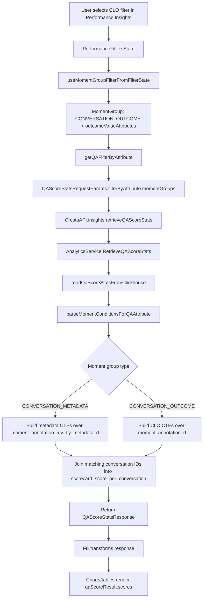

# CLO Filter Data Flow in Performance Insights

**Created:** 2026-06-18
**Scope:** CONVI-7049, Performance Insights CLO filter

This document traces the data flow for a Cresta-modeled outcome (CLO) filter from the Director frontend into the analytics backend, then back into Performance Insights widgets.

## Summary

The frontend can now surface CLO filters in Performance Insights and build the expected analytics request shape:

```text
Performance filter state
  -> QAAttribute.momentGroups[]
  -> RetrieveQAScoreStatsRequest.filterByAttribute.momentGroups[]
  -> AnalyticsService.RetrieveQAScoreStats
```

Backend PR `cresta/go-servers#29175` adds the missing ClickHouse query support for this request shape. A CLO filter is sent as a `Moment_CONVERSATION_OUTCOME` moment group with `outcomeValueAttributes`; the backend now parses that shape, queries `moment_annotation_d`, and joins matching conversations into the QA score stats query.

## 1. How FE Builds the Query

### Filter option setup

The Performance filter menu registers two Cresta-modeled outcome filter keys:

- `FilterKey.CONVERSATION_OUTCOME_MOMENT`
- `FilterKey.OUTCOME_NUMERIC_BIN`

The options are populated from `useOutcomeCategories`, then passed to the shared outcome level-select hooks in:

- `/Users/xuanyu.wang/repos/director-convi-7049/packages/director-app/src/components/insights/hooks/performance-filters/usePerformanceFilters.tsx:513`
- `/Users/xuanyu.wang/repos/director-convi-7049/packages/director-app/src/components/insights/hooks/performance-filters/usePerformanceFilters.tsx:543`

The relevant hook args are:

```ts
[FilterKey.CONVERSATION_OUTCOME_MOMENT]: {
  conversationOutcomeMoments: outcomeCategoriesHookResult.conversationOutcomeMoments,
  loading: outcomeCategoriesHookResult.loading,
  pageVariant: 'performance-insights-page',
},
[FilterKey.OUTCOME_NUMERIC_BIN]: {
  conversationOutcomeMoments: outcomeCategoriesHookResult.conversationOutcomeMoments.filter((moment) => {
    const numericBins = moment.payload?.numericBins;
    return Array.isArray(numericBins) && numericBins.length > 0;
  }),
  loading: outcomeCategoriesHookResult.loading,
  pageVariant: 'performance-insights-page',
},
```

The selected values land in `PerformanceFiltersState` as:

- `conversationOutcomeToOutcomeValues: Map<string, OutcomeValueWithOutcomeMoment[]>`
- `outcomeNumericBins: Map<string, NumericBinWithConvOutcomeMoment[]>`

### Filter state to `MomentGroup`

Performance widgets call `useQAScoreStatsRequestParams(filtersState, groupBy, options)`.

That calls `useQAFilterByAttribute`, which calls `useMomentGroupFilterFromFilterState`. The CLO-specific conversion is in:

- `/Users/xuanyu.wang/repos/director-convi-7049/packages/director-app/src/components/insights/hooks/useMomentGroupFilterFromFilterState.ts:36`

For numeric bins:

```ts
momentGroupFilter.push({
  moments: [transformMoment(bin[0]!.outcomeMoment)],
  outcomeValueAttributes: bin.map((some) =>
    transformConversationOutcomeValueToOutcomeValueApi({
      value: { numberValue: some.numericBin.fromValue },
      numericBin: some.numericBin,
      description: some.numericBin.description ?? '',
      binaryOutcomeValueEnum: some.numericBin.binaryOutcomeValueEnum,
    })
  ),
});
```

For allowed outcome values:

```ts
momentGroupFilter.push({
  moments: [transformMoment(outcomeValueWithOutcomeMoment[0]!.outcomeMoment)],
  outcomeValueAttributes: outcomeValueWithOutcomeMoment.map((some) =>
    transformConversationOutcomeValueToOutcomeValueApi(some)
  ),
});
```

The important shape is:

```ts
{
  moments: [
    {
      name: 'customers/{customer}/profiles/{profile}/moments/{momentTemplateId}',
      type: Moment_CONVERSATION_OUTCOME,
      taxonomy: '<outcome taxonomy>',
    },
  ],
  outcomeValueAttributes: [
    {
      outcomeValue: { stringValue | numberValue | booleanValue },
      numericBin?: { fromValue, toValue, ... },
    },
  ],
}
```

### `MomentGroup` to `QAAttribute`

`useQAFilterByAttribute` attaches those moment groups to `QAAttribute.momentGroups` through `getQAFilterByAttribute`:

- `/Users/xuanyu.wang/repos/director-convi-7049/packages/director-app/src/components/insights/hooks/util-hooks/useQAFilterByAttribute.ts:17`
- `/Users/xuanyu.wang/repos/director-convi-7049/packages/director-app/src/components/insights/hooks/util-hooks/getQAFilterByAttribute.ts:72`

The `MomentGroupFilter` objects are transformed into API protobuf-compatible objects by `transformMomentGroupFiltersToApi`:

- `/Users/xuanyu.wang/repos/director-convi-7049/packages/director-app/src/hooks/insights/useFilterByAttributes.ts:102`

### `QAAttribute` to `RetrieveQAScoreStatsRequest`

`getQAScoreStatsRequestParams` builds the request params:

- `/Users/xuanyu.wang/repos/director-convi-7049/packages/director-app/src/components/insights/hooks/util-hooks/useQAScoreStatsRequestParams.ts:23`

It includes:

- `frequency`
- `filterByTimeRange`
- `groupByAttributeTypes`
- `filterByAttribute`
- `scoreResource`
- `includePeerUserStats`
- `conversationTimeRangeField`
- `filterToAgentsOnly`

The CLO filter is nested at:

```text
requestParams.filterByAttribute.momentGroups[].outcomeValueAttributes[]
```

## 2. Which BE API Was Called

Performance score widgets call:

- `/Users/xuanyu.wang/repos/director-convi-7049/packages/director-app/src/components/insights/hooks/useQAScoreStats.ts:6`

`useQAScoreStats` calls:

```ts
CrestaAPI.insights.retrieveQAScoreStats(requestParams)
```

The Director API wrapper calls the web-client analytics RPC:

- `/Users/xuanyu.wang/repos/director-convi-7049/packages/director-api/src/services/cresta-api/insights/insightsApi.ts:399`

```ts
return this.wrapRequest(
  (data, init) => AnalyticsService.RetrieveQAScoreStats(data, init),
  this.getRequestPayloadForRetrieveQAScoreStats(requestParams),
  (response) => ({ ...transformQAScoreStatsResponse(response), chapterId: chapterId })
);
```

The request payload adds:

- `parent`
- timezone `metadata`
- the request params, including `filterByAttribute.momentGroups`

See:

- `/Users/xuanyu.wang/repos/director-convi-7049/packages/director-api/src/services/cresta-api/insights/insightsApi.ts:243`

Backend endpoint:

```text
AnalyticsService.RetrieveQAScoreStats
```

Backend implementation entry:

- `/Users/xuanyu.wang/repos/go-servers/insights-server/internal/analyticsimpl/retrieve_qa_score_stats.go:57`

## 3. How BE API Queries DB

### Request handling

`AnalyticsServiceImpl.RetrieveQAScoreStats`:

1. Parses `req.Parent`.
2. Normalizes `req.FilterByAttribute`.
3. Resolves users/groups and scorecard reviewer audiences.
4. Applies scorecard status filtering.
5. Delegates to `retrieveQAScoreStatsInternal`.

Entry points:

- `/Users/xuanyu.wang/repos/go-servers/insights-server/internal/analyticsimpl/retrieve_qa_score_stats.go:57`
- `/Users/xuanyu.wang/repos/go-servers/insights-server/internal/analyticsimpl/retrieve_qa_score_stats.go:228`

The current internal path uses ClickHouse:

- `/Users/xuanyu.wang/repos/go-servers/insights-server/internal/analyticsimpl/retrieve_qa_score_stats.go:303`
- `/Users/xuanyu.wang/repos/go-servers/insights-server/internal/analyticsimpl/retrieve_qa_score_stats_clickhouse.go:428`

### Main ClickHouse query path

`readQaScoreStatsFromClickhouse` builds condition groups for several logical tables:

- common scorecard/conversation filters
- scorecard filters
- score filters
- conversation filters
- moment filters
- group-by clauses

Relevant code:

- `/Users/xuanyu.wang/repos/go-servers/insights-server/internal/analyticsimpl/retrieve_qa_score_stats_clickhouse.go:436`
- `/Users/xuanyu.wang/repos/go-servers/insights-server/internal/analyticsimpl/retrieve_qa_score_stats_clickhouse.go:477`

Moment filters are parsed by:

- `/Users/xuanyu.wang/repos/go-servers/insights-server/internal/analyticsimpl/common_clickhouse.go:830`

Current behavior after backend PR `cresta/go-servers#29175`:

```go
if len(momentGroup.Moments) == 1 &&
  momentGroup.Moments[0].Type == momentpb.Moment_CONVERSATION_METADATA &&
  len(momentGroup.MetadataValueAttributes) > 0 {
  conditionsAndArgsList, err := convertMetadataMomentGroupFilter(...)
  momentConditionsAndArgsList = append(momentConditionsAndArgsList, conditionsAndArgsList)
}

if len(momentGroup.Moments) == 1 &&
  momentGroup.Moments[0].Type == momentpb.Moment_CONVERSATION_OUTCOME &&
  len(momentGroup.OutcomeValueAttributes) > 0 {
  conditionsAndArgsList, err := convertConversationOutcomeMomentGroupFilter(...)
  momentConditionsAndArgsList = append(momentConditionsAndArgsList, conditionsAndArgsList)
}
```

This supports both:

- `Moment_CONVERSATION_METADATA` with `MetadataValueAttributes`
- `Moment_CONVERSATION_OUTCOME` with `OutcomeValueAttributes`

### Metadata-backed query shape

When moment filters are present, `RetrieveQAScoreStats` uses:

- `/Users/xuanyu.wang/repos/go-servers/insights-server/internal/analyticsimpl/retrieve_qa_score_stats_clickhouse.go:247`

This builds CTEs against:

```sql
moment_annotation_mv_by_metadata_d
```

and joins the matching conversation IDs into:

```sql
scorecard_score_per_conversation
```

Relevant SQL-building lines:

- `/Users/xuanyu.wang/repos/go-servers/insights-server/internal/analyticsimpl/retrieve_qa_score_stats_clickhouse.go:275`
- `/Users/xuanyu.wang/repos/go-servers/insights-server/internal/analyticsimpl/retrieve_qa_score_stats_clickhouse.go:306`
- `/Users/xuanyu.wang/repos/go-servers/insights-server/internal/analyticsimpl/retrieve_qa_score_stats_clickhouse.go:378`

For metadata filters, `convertMetadataMomentGroupFilter` creates conditions over:

- `moment_template_id`
- `metadata_string_value`
- `metadata_number_value`
- `metadata_bool_value`

Relevant code:

- `/Users/xuanyu.wang/repos/go-servers/insights-server/internal/analyticsimpl/common_clickhouse.go:1248`

### CLO-backed query shape

For CLO filters, the backend uses `moment_annotation_d`, not `moment_annotation_mv_by_metadata_d`.

Reason:

- `moment_annotation_mv_by_metadata_d` is pre-filtered to metadata rows.
- CLO rows are `moment_type = 14`, not metadata rows.
- CLO values live in `moment_annotation_payload`, not `metadata_*_value` columns.

The generated ClickHouse conditions include:

```text
moment_type = 14
moment_template_id = <outcome moment template ID>
JSONExtractString(moment_annotation_payload, 'conversation_outcome_payload', 'string_value') = ?
JSONExtractFloat(moment_annotation_payload, 'conversation_outcome_payload', 'number_value') >= ?
JSONExtractFloat(moment_annotation_payload, 'conversation_outcome_payload', 'number_value') < ?
JSONHas(moment_annotation_payload, 'conversation_outcome_payload', 'boolean_value') = ?
JSONExtractBool(moment_annotation_payload, 'conversation_outcome_payload', 'boolean_value') = ?
JSONHas(moment_annotation_payload, 'conversation_outcome_payload', 'number_value') = ?
JSONExtractFloat(moment_annotation_payload, 'conversation_outcome_payload', 'number_value') = ?
```

Exact boolean and exact number filters use `JSONHas` guards because ClickHouse JSON extraction functions return defaults for missing keys. Without the guard, a missing boolean key could match `false`, and a missing numeric key could match `0`.

## 4. How FE Uses the Response

The response is transformed by:

- `/Users/xuanyu.wang/repos/director-convi-7049/packages/director-api/src/services/cresta-api/insights/transformersQAI.ts:29`

The frontend receives:

```ts
{
  qaScoreResult: {
    scores: QAScore[],
    averageQaScore,
    totalConversationCount,
    totalScorecardCount,
  }
}
```

Common Performance usages:

- Score line chart builds request params and reads `qaScoreResult.scores` through `createHighchartsSeries`.
  - `/Users/xuanyu.wang/repos/director-convi-7049/packages/director-app/src/components/insights/qa-insights/score-line-chart/ScoreLineChartGraph.tsx:70`
  - `/Users/xuanyu.wang/repos/director-convi-7049/packages/director-app/src/components/insights/qa-insights/score-line-chart/ScoreLineChartGraph.tsx:116`
- Stats graph requests score stats grouped by criterion/time range, then filters response scores by criterion ID and builds score maps.
  - `/Users/xuanyu.wang/repos/director-convi-7049/packages/director-app/src/components/insights/qa-insights/stats-graph-container/hooks/useStatsData.ts:27`
  - `/Users/xuanyu.wang/repos/director-convi-7049/packages/director-app/src/components/insights/qa-insights/stats-graph-container/hooks/useStatsData.ts:42`
- Conversation count chart separately calls `useQAScoreStats` for filtered and unfiltered scorecard counts.
  - `/Users/xuanyu.wang/repos/director-convi-7049/packages/director-app/src/components/insights/qa-insights/conversation-count-chart/ConversationCountChart.tsx:138`

These widgets automatically consume the filtered score stats because the CLO filter is part of the same `requestParams` query key and request payload.

## End-to-End Flow



## Questions Captured From Review

### How does FE build the query?

FE stores selected CLO filters in Performance filter state, converts them into `MomentGroup` objects, then places them under:

```text
RetrieveQAScoreStatsRequest.filterByAttribute.momentGroups
```

### Which BE API is called?

Performance widgets call:

```text
AnalyticsService.RetrieveQAScoreStats
```

through `CrestaAPI.insights.retrieveQAScoreStats`.

### How does BE query the DB?

The API builds ClickHouse SQL. CLO filters create moment annotation CTEs over:

```text
moment_annotation_d
```

The CTE returns matching conversation IDs, then the main score stats query joins those IDs into `scorecard_score_per_conversation`.

### How does FE use the response?

FE does not need CLO-specific response parsing. It uses the same `QAScoreStatsResponse` as other Performance filters. Once the backend filters the score stats query correctly, charts and counts consume the filtered `qaScoreResult.scores`, `totalConversationCount`, and `totalScorecardCount`.

## Implementation Implication

The Director PR adds the frontend filter selection path. Backend PR `cresta/go-servers#29175` adds the ClickHouse query path. The key validation is the generated ClickHouse request test for `RetrieveQAScoreStats` containing a `Moment_CONVERSATION_OUTCOME` moment group.
