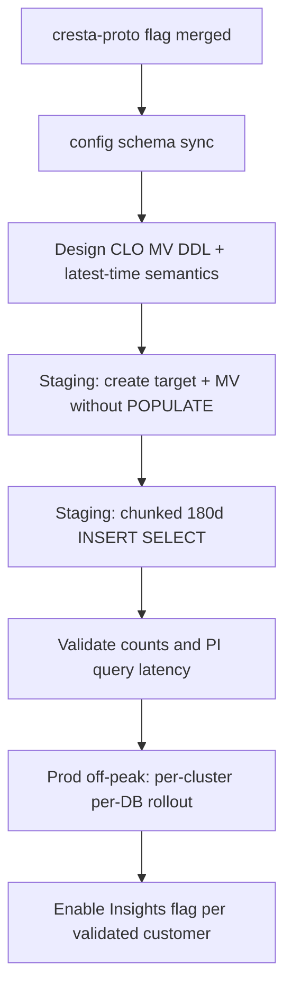

# CLO Materialized View: ClickHouse Creation, Backfill, and TTL Investigation

**Date:** 2026-07-28
**Ticket:** [CONVI-7383](https://linear.app/cresta/issue/CONVI-7383/improve-clo-conversation-outcome-filter-query-performance-via) (related [CONVI-7049](https://linear.app/cresta/issue/CONVI-7049/support-clo-filter-in-performance-insights))
**Primary sources:** `/Users/xuanyu.wang/repos/clickhouse-schema`, ClickHouse docs (backfilling / CREATE VIEW), knowledge `moment-and-moment-annotation-background.md`

## Executive summary

Cresta’s in-repo pattern for conversation-cluster MVs is **`CREATE MATERIALIZED VIEW … ENGINE = ReplicatedReplacingMergeTree … POPULATE AS SELECT`**, then a separate **Distributed `_d` table**. Historical fills always come from `POPULATE` at create/recreate time; there is **no** checked-in job for chunked `INSERT INTO … SELECT` backfill, and **no TTL** on `moment_annotation` or its MVs.

ClickHouse’s own docs **discourage `POPULATE` on live production tables**: inserts that land during populate can be silently missed, and a full populate is a heavy, interruptible scan. For a new CLO MV with a **180-day** history requirement and active writes, the safer design is:

1. Create an explicit target table (monthly partitioned).
2. Create the MV **`TO` that table without `POPULATE`** so live inserts start feeding immediately.
3. **Chunked** `INSERT INTO target SELECT … WHERE conversation_start_time` over the last 180 days (e.g. by month), off-peak, with monitoring.
4. Create the Distributed `_d` table; only then flip the Insights config flag.

**TTL is optional, not required for correctness.** Prefer **monthly partitions** (matches metadata MV). Use TTL or partition drops only if product agrees CLO filter history beyond ~180 days is never needed from the MV (raw `moment_annotation_d` still holds longer history).

---

## 1. Background: what a materialized view is

### 1.1 General idea (Postgres and OLAP alike)

A **materialized view** is a query whose **result is stored** as a physical table (or table-like object), instead of being recomputed on every read like a normal view.

| Concept | Ordinary view | Materialized view |
|---|---|---|
| Storage | No data; query rewritten at read time | Persists rows on disk |
| Read cost | Pays full query cost each time | Cheap if the stored shape matches access patterns |
| Freshness | Always current | Stale until refreshed / updated |
| Write cost | None | Must keep the stored result up to date |

**When MVs help**

- Repeated analytical queries scan a wide fact table but only need a narrow projection or pre-aggregation.
- Filters select a small subset of row types (e.g. only metadata moments, only CLO moments).
- Query predicates align with the MV’s sort key / partitions better than the base table.

**When MVs hurt**

- Extra storage and write amplification (every insert into the source may also write the MV).
- Schema/migration cost; backfill risk on large histories.
- If the query shape changes, the MV may not help or may need recreation.

### 1.2 Postgres-style MVs (contrast)

In PostgreSQL, `CREATE MATERIALIZED VIEW` stores a snapshot. Freshness is usually via **`REFRESH MATERIALIZED VIEW`** (full or concurrent). There is no automatic “on insert” update unless you build triggers or use extensions. Postgres MVs are closer to **scheduled snapshots**.

### 1.3 ClickHouse-style MVs (what Cresta uses)

In ClickHouse, a classic materialized view is an **insert trigger**, not a scheduled refresh:

1. Client inserts a block into the **source** table (e.g. `moment_annotation`).
2. ClickHouse runs the MV’s `SELECT` on that **in-memory insert block** (not a full table scan).
3. Transformed rows are written to the MV’s **target** storage.

Implications:

- **New data after create** flows automatically.
- **Existing historical data does not**, unless you backfill (`POPULATE` or manual `INSERT SELECT`).
- Heavy transforms on every insert add latency/load to the write path.
- Cresta’s metadata MV is a **projection + filter** MV (`WHERE moment_type = 19`, typed columns), not an aggregate rollup.

Official docs: [CREATE VIEW / Materialized View](https://clickhouse.com/docs/sql-reference/statements/create/view), [Backfilling](https://clickhouse.com/docs/data-modeling/backfilling).

### 1.4 Two ways to get historical data into a ClickHouse MV

| Approach | Mechanism | Pros | Cons |
|---|---|---|---|
| **`POPULATE`** | At `CREATE MATERIALIZED VIEW`, scan all matching source rows into the target | One statement; matches Cresta’s historical scripts | ClickHouse **does not recommend** for live ingest: rows inserted during populate can be **missed**; large tenants → timeouts / memory pressure; hard to resume mid-flight |
| **Manual backfill** | Create MV **without** `POPULATE` (trigger live immediately), then `INSERT INTO target SELECT …` in chunks | Controllable load; resumable; recommended by ClickHouse for production | More operational steps; need careful time-window overlap so live + backfill don’t leave gaps (or accept ReplacingMergeTree dedupe) |

Cresta’s repo today uses **only `POPULATE`**. That is the path of least cultural resistance, but it is the riskier path for a large production `moment_annotation` table under continuous writes.

---

## 2. Cresta’s existing MV pattern (conversations cluster)

### 2.1 Dual path: new DB vs existing DB

| Path | Mechanism | File / script |
|---|---|---|
| New customer DB | Full `init_db.up.sql` via migrate | `conversations/migrations/20230824160348_init_db.up.sql` + `create_database_and_tables_if_absent` |
| Existing customer DBs | SQL in `queries.sql` applied per DB | `conversations/scripts/run_queries_in_existing_database/` |

Active `queries.sql` today is **not** MV DDL (column alters only). Past MV creates/recreates live under `history_queries/` as runbooks to copy from.

### 2.2 Canonical metadata MV (template for CLO)

From `init_db.up.sql`:

```sql
CREATE MATERIALIZED VIEW IF NOT EXISTS `moment_annotation_mv_by_metadata` ON CLUSTER 'conversations'
ENGINE = ReplicatedReplacingMergeTree(
  '/clickhouse/tables/{cluster}-{shard}/{database}/v0.24/moment_annotation_mv_by_metadata',
  '{replica}', update_time)
PARTITION BY toYYYYMM(conversation_start_time)
PRIMARY KEY (toStartOfHour(conversation_start_time), conversation_id, moment_template_id)
ORDER BY (toStartOfHour(conversation_start_time), conversation_id, moment_template_id)
POPULATE AS
SELECT
  conversation_id,
  conversation_start_time,
  moment_template_id,
  metadata_string_value,
  metadata_number_value,
  metadata_bool_value,
  update_time
FROM `moment_annotation`
WHERE moment_type = 19;

CREATE TABLE IF NOT EXISTS `moment_annotation_mv_by_metadata_d` ON CLUSTER 'conversations'
AS `moment_annotation_mv_by_metadata`
ENGINE = Distributed('{cluster}', 'DATABASE_NAME_TO_REPLACE',
  'moment_annotation_mv_by_metadata', toUnixTimestamp(conversation_start_time));
```

Properties to copy for CLO:

- Local MV + separate Distributed `_d` (do **not** make the distributed object itself a POPULATE MV — older scripts did; modern pattern is Distributed **table**).
- Monthly `PARTITION BY toYYYYMM(conversation_start_time)`.
- Narrow projection + `moment_type` filter.
- Keeper path under `v0.24/<unique_name>`.
- Filter CLO as `moment_type = 14`, with typed outcome columns (not JSON payload), per prior design notes.

### 2.3 Recreate ordering (from INSI-1073 partition migration)

Documented in `history_queries/queries_add_partitions_to_materialized_views.sql`:

1. `DROP` Distributed `_d`
2. `DROP` local MV `SYNC`
3. `CREATE MATERIALIZED VIEW … POPULATE`
4. `CREATE` Distributed `_d`

Operational cautions from that file:

- One MV at a time
- Off-peak
- Expect timeouts; tune `max_execution_time`, `max_memory_usage`
- After partial timeout, verify partition row counts
- Monitor ClickHouse via Groundcover

Repo-wide prod rule (`clickhouse-schema/README.md`): schema changes **after 6pm PST**; dry-run before schedule and immediately before apply. Cover all 7 clusters (3 staging + 4 prod).

### 2.4 What Cresta does *not* have today

- No `WITHOUT POPULATE` + chunked backfill scripts
- No TTL on `moment_annotation` / annotation MVs
- No documented 180-day MV retention policy (180 days in CONVI-7049 work is primarily a **Performance Insights query window**, not CH TTL)
- TTL elsewhere is only short-lived queues/logs (`delete_conversation_queue`, `request_log`: **2 weeks**)

---

## 3. Requirement: backfill 180 days of CLO history

### 3.1 What “180 days” means for the MV

Two different policies get conflated:

| Policy | Meaning |
|---|---|
| **Backfill window** | When creating the MV, only load CLO rows with `conversation_start_time` (or equivalent) in the last 180 days into the target |
| **Retention / TTL** | Continuously delete MV rows older than 180 days so the MV stays small |

You can implement backfill without TTL (MV grows forever via live inserts + initial 180d). You can also TTL without limiting the initial populate (wasteful). For Performance Insights, matching the common UI window suggests **at least** a 180-day backfill; retention is a separate product/ops decision.

### 3.2 Option A — Cresta-familiar: `POPULATE` with a 180-day predicate

```sql
CREATE MATERIALIZED VIEW ...
POPULATE AS
SELECT ...
FROM moment_annotation
WHERE moment_type = 14
  AND conversation_start_time >= now() - INTERVAL 180 DAY;
```

After create, **live inserts of all matching CLO rows** still enter the MV (the `WHERE` applies to both populate and the insert trigger unless structured carefully). Important nuance:

- If the MV `SELECT` includes `conversation_start_time >= now() - INTERVAL 180 DAY`, then **old inserts of ancient conversations** would also be filtered out going forward — good for size, bad if you ever need older CLO filters from the MV.
- If the MV `SELECT` is only `moment_type = 14` (no time filter) but `POPULATE` somehow limited history: with classic Cresta DDL, populate and ongoing filter are the **same** `SELECT`. You cannot easily “populate 180d only, then accept all ages forever” without the safer TO-table + separate backfill pattern.

**Recommendation if using POPULATE:** either

- populate **all** CLO history (expensive, mirrors metadata MV), or
- put **`moment_type = 14` only** in the MV and accept full historical populate cost, or
- put **time filter in the MV** and accept that the MV never serves CLO filters older than that rolling window (must align TTL/product).

### 3.3 Option B — ClickHouse-recommended: create live, then chunked backfill (preferred for prod)

Shape:

```text
1. CREATE TABLE moment_annotation_mv_by_conversation_outcome (... )
   ENGINE = ReplicatedReplacingMergeTree(..., update_time)
   PARTITION BY toYYYYMM(conversation_start_time)
   ORDER BY (...)

2. CREATE MATERIALIZED VIEW ... TO moment_annotation_mv_by_conversation_outcome
   AS SELECT ... FROM moment_annotation WHERE moment_type = 14;
   -- no POPULATE: live CLO inserts start feeding immediately

3. For each month M in the last ~6 months (and current partial month):
     INSERT INTO moment_annotation_mv_by_conversation_outcome
     SELECT <same projection>
     FROM moment_annotation
     WHERE moment_type = 14
       AND conversation_start_time >= <M start>
       AND conversation_start_time <  <M end>;
     -- off-peak; SETTINGS for timeout/memory; pause between chunks

4. CREATE TABLE ..._d AS ... ENGINE = Distributed(...)

5. Validate row counts vs source for the 180d window

6. Enable Insights flag use_conversation_outcome_moment_annotation_materialized_view per customer
```

Why this fits the requirements:

- **Backfill is explicit** and limited to 180 days.
- **Load is controllable** (one month / one customer / one cluster at a time).
- **Live gap risk of POPULATE is avoided** (MV is attached before backfill). Overlap between live and backfill on ReplacingMergeTree is generally safe (duplicates collapse by version column).
- Aligns with ClickHouse docs; diverges from Cresta’s historical scripts — treat as an intentional, documented exception and get ClickHouse/oncall buy-in.

### 3.4 Option C — Hybrid compromise

Use Cresta-style `CREATE MV … POPULATE` **only on small/staging DBs**, and for large prod tenants use Option B. Same final schema; different rollout procedure. Higher operational complexity.

### 3.5 Workload safety checklist (either option)

From Cresta runbooks + ClickHouse guidance:

1. Staging clusters first; measure `query_duration_ms`, `read_rows`, memory, disk growth.
2. Prod after **6pm PST**; dry-run twice.
3. **One customer DB at a time** for large tenants (or batch small ones).
4. Do not recreate/populate many MVs in parallel (history file: one MV at a time).
5. Watch Groundcover ClickHouse dashboards; abort if cluster queue/latency spikes.
6. Tune `max_execution_time` / `max_memory_usage`; verify partitions after timeouts.
7. Keep the Insights config flag **off** until backfill validation passes for that customer DB.
8. After schema lands in `init_db`, bump `clickhouseschema` for insights-batch-processor so **new** DBs get the objects (decide whether new DBs use POPULATE-full or empty+backfill).

---

## 4. TTL: do we need it?

### 4.1 What TTL does in ClickHouse

`TTL expr DELETE` (or `TO DISK` / `TO VOLUME`) schedules merge-time expiration of rows (or parts). It is a **retention** tool, not a backfill tool.

### 4.2 Cresta precedent

| Object | TTL |
|---|---|
| `moment_annotation` / MVs | **None** |
| `delete_conversation_queue` | 2 weeks |
| `request_log` | 2 weeks |

The metadata MV stays small primarily by **filtering to `moment_type = 19`** and projecting few columns, plus **monthly partitions** (ops can drop old partitions manually if needed). It does **not** rely on TTL.

### 4.3 Options for the CLO MV

| Approach | Effect | When to choose |
|---|---|---|
| **No TTL** (like metadata MV) | MV grows with all live CLO inserts forever (plus whatever you backfilled) | Default; simplest; CLO volume is usually much smaller than all moment types |
| **TTL = 180 days** on `conversation_start_time` | Auto-delete old MV parts; keeps MV bounded | Product confirms PI never needs CLO filters beyond ~180 days **from the MV** (longer ranges fall back to raw table or fail closed) |
| **Partition drop runbook** (no TTL) | Ops periodically `DROP PARTITION` older than N months | Prefer operational control over automatic deletes; matches monthly partition design |

### 4.4 Recommendation on TTL

- **Do not block MV creation on TTL.** Monthly partitions + narrow CLO filter are the first size controls.
- **Add TTL only after** confirming with product that CLO Performance Insights filters never need >180 days of MV coverage **and** that automatic deletion is acceptable.
- If TTL is added, use the same column as partitions (`conversation_start_time`), document that queries older than the TTL must not use the MV path (flag stays off or query builder falls back to `moment_annotation_d`).
- Disk-size playbooks already exist in Notion; CLO MV should be listed in `check_missing_materialized_views.py`’s target list once shipped.

---

## 5. Recommended design for CONVI-7383

### 5.1 Object names (provisional)

- Local: `moment_annotation_mv_by_conversation_outcome`
- Distributed: `moment_annotation_mv_by_conversation_outcome_d`
- Filter: `moment_type = 14`
- Columns: typed outcome fields + times + `moment_template_id` (see `moment-and-moment-annotation-background.md`); resolve `create_time` vs `update_time` for “latest” semantics before DDL freeze.

### 5.2 Preferred rollout sequence



### 5.3 Decision matrix

| Question | Recommendation |
|---|---|
| Follow Cresta `POPULATE` literally? | Only if ClickHouse/oncall accepts miss-window + full/timeout risk; otherwise **manual 180d chunked backfill** |
| Backfill how much? | **180 days** of `conversation_start_time` (requirement) |
| Separate job? | **Yes** — treat backfill as an explicit rollout step, not only an invisible side effect of `CREATE` |
| TTL now? | **No by default**; revisit after measuring MV size growth |
| Flag before MV ready? | Config flag stays **false** until that customer’s MV + backfill validated |

### 5.4 Open questions before implementation

1. Confirm “latest annotation” column: CLO raw path uses `create_time`; metadata MV uses `update_time`.
2. Exact typed column encoding for `oneof` (false/0 vs missing).
3. Whether new customer onboarding (`init_db`) should `POPULATE` full CLO history or create empty MV (new tenants have little history).
4. Who runs prod apply (insights vs data platform oncall) and whether Notion operating guide already forbids/allows non-POPULATE creates.
5. Whether any PI CLO query ranges exceed 180 days in practice.

---

## 6. Source index

| Source | Relevance |
|---|---|
| `clickhouse-schema/conversations/migrations/20230824160348_init_db.up.sql` | Canonical MV + TTL examples |
| `.../history_queries/queries_add_partitions_to_materialized_views.sql` | Recreate order + load warnings |
| `clickhouse-schema/README.md` | Off-peak / dry-run policy; Notion links |
| ClickHouse docs: backfilling | Prefer no `POPULATE`; chunked `INSERT SELECT` |
| `knowledge/convi-7049-clo-filter/moment-and-moment-annotation-background.md` | Proposed CLO MV shape |
| Proto flag | `use_conversation_outcome_moment_annotation_materialized_view` (field 30, default off) |

---

## 7. Bottom line

- **General pattern:** MVs store query results for faster reads; ClickHouse MVs update on **insert**, so history needs an explicit backfill.
- **Cresta today:** `POPULATE` everywhere; off-peak + dry-run for safety; no annotation TTL.
- **For CLO + 180 days + prod safety:** prefer **create MV without populate → chunked 180-day backfill → validate → enable config flag**, and treat full `POPULATE` as a last resort that conflicts with ClickHouse’s own guidance.
- **TTL:** not required to ship; monthly partitions + CLO-only filter first; add 180-day TTL only if product commits to that retention.
