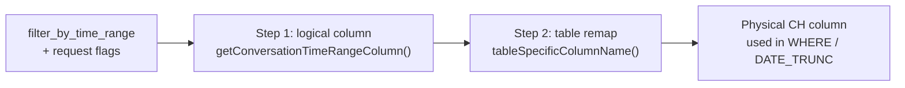
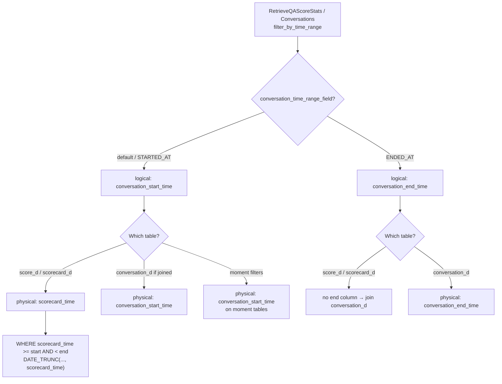
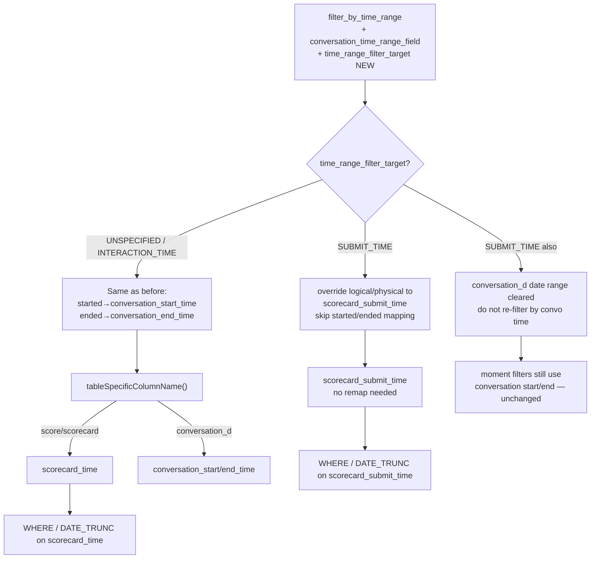

# QA Time Range Filter → ClickHouse Column Mapping

**Date:** 2026-07-30
**Context:** CONVI-7162 Manager Leaderboard submit-time fix
**Code:** `go-servers` worktree `go-servers-convi-7162` (`retrieve_qa_score_stats_clickhouse.go`, `common_clickhouse.go`)

Explains how `filter_by_time_range` is translated into physical ClickHouse columns **before** and **after** the `time_range_filter_target` change.

---

## Shared pipeline (unchanged shape)

The pipeline is a **two-step rename**, then a `WHERE` / `DATE_TRUNC` on the resulting physical column.

### Step 1 — logical column (`getConversationTimeRangeColumn`)

| `conversation_time_range_field` | Logical column |
|---|---|
| unspecified / started-at (default) | `conversation_start_time` |
| ended-at | `conversation_end_time` |

### Step 2 — table remap (`tableColumnNameMapping` for score/scorecard tables)

| Logical | On `score_d` / `scorecard_d` | On `conversation_d` |
|---|---|---|
| `conversation_start_time` | **`scorecard_time`** | `conversation_start_time` |
| `conversation_end_time` | column-not-exist (needs conversation join) | `conversation_end_time` |

So before our change, “default QA time range” meant:

`filter_by_time_range` → `conversation_start_time` → **`scorecard_time`** (interaction / convo start).

---

## Before the change

Only knobs: `filter_by_time_range` + `conversation_time_range_field`.

**Manager Leaderboard (pre-fix):** never set ended-at → always landed on **`scorecard_time`**.

---

## After the change

Same two steps, plus an optional **override** from `time_range_filter_target`:

### What the new field does in code

1. `qaTimeRangeFilterTargetOptions(...)`
   - default: `WithTimeRangeType(conversation_time_range_field)` only
   - `SUBMIT_TIME`: also `WithTimeRangeColumn("scorecard_submit_time")`
2. That override makes Step 1 return `scorecard_submit_time` directly, so Step 2 does **not** turn it into `scorecard_time`.
3. For `conversation_d`, submit-time mode passes `nil` time range so the selected window is **not** applied again as conversation start/end.
4. Moment filters still use conversation start/end (intentionally not submit time).
5. No runtime rejection if `SUBMIT_TIME` is combined with `CONVERSATION_ENDED_AT`; Manager (and other callers) simply do not set both. If both were set, the submit-time override wins on score/scorecard tables.

---

## Side-by-side: same Manager request

Assume: date range Jun 15–21, default started-at, scorecard resource.

| Stage | Before | After (`SUBMIT_TIME`) |
|---|---|---|
| Request flags | no target field | `time_range_filter_target=SUBMIT_TIME` |
| Step 1 logical | `conversation_start_time` | `scorecard_submit_time` (override) |
| Step 2 on `scorecard_d` | → `scorecard_time` | stays `scorecard_submit_time` |
| Filter SQL | `scorecard_time >= … AND < …` | `scorecard_submit_time >= … AND < …` |
| Daily group | `DATE_TRUNC(..., scorecard_time)` | `DATE_TRUNC(..., scorecard_submit_time)` |
| `conversation_d` time filter | may apply same range as start time if join needed | **not** applied for the date range |
| Moment time filter | conversation start | conversation start (unchanged) |

---

## Mental model

- **Before:** “time range” on QA scorecard tables always meant **interaction time**, because logical “conversation start” is aliased to `scorecard_time`.
- **After:** same translation **unless** Manager (or anyone) sets `SUBMIT_TIME`, which short-circuits the alias and points filter/group at **`scorecard_submit_time`**. Unspecified callers keep the old path.
