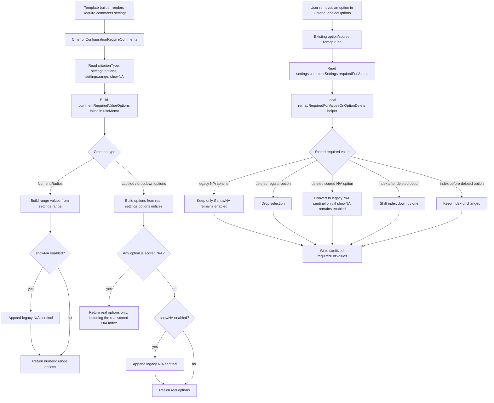

# CONVI-6955: Required Comments Dropdown Duplicates and Mis-remaps N/A

**Created:** 2026-06-01
**Issue:** [CONVI-6955](https://linear.app/cresta/issue/CONVI-6955/na-in-scorecard-duplicate-na-entries-in-require-comments-dropdown)
**PR:** [director#19238](https://github.com/cresta/director/pull/19238)

## Investigation

The template-builder "Require comments" dropdown was built from option indices, with a synthetic legacy N/A entry appended whenever `showNA` was enabled. That logic did not distinguish between:

- legacy N/A exposed through `showNA`
- scored N/A represented as a real option with `isNA: true`

Separately, deleting labeled options already remapped branch and AutoQA indices, but it did not remap `settings.commentSettings.requiredForValues`, which is also stored as option indices.

## Root Cause

This ticket had one independent root cause with two visible symptoms:

1. `CriterionConfigurationRequireComments.tsx` treated `showNA` as sufficient to append a synthetic N/A entry, even when `settings.options` already contained a real scored-N/A option.
2. `CriteriaLabeledOptions.tsx` did not remap `commentSettings.requiredForValues` when options were deleted, so stale indices could shift onto the wrong option, including N/A.

## Solution

Implemented in `director` on branch `xwang/convi-6955-na-required-comments`.

- Kept the require-comments dropdown construction inline in `CriterionConfigurationRequireComments.tsx`.
- Synthetic N/A is now added only when `showNA` is enabled and no real scored-N/A option exists.
- Scored N/A is shown only once, using the real option index.
- Added remapping for `commentSettings.requiredForValues` directly in `CriteriaLabeledOptions.tsx` during option deletion.
- Deleting a normal option now drops that requirement instead of silently converting it to N/A.
- Deleting a scored N/A converts the requirement to the legacy N/A sentinel only when `showNA` stays enabled.

## Code Flow Diagram



## Code Walkthrough

The implementation keeps this small and local: dropdown option construction stays in `CriterionConfigurationRequireComments.tsx`, and deletion remapping lives in `CriteriaLabeledOptions.tsx` where option deletion already happens.

### 1. `CriterionConfigurationRequireComments` builds dropdown options inline

The component reads the current form state for `criterionType`, `settings.options`, `settings.range`, and `settings.showNA`, then builds `commentRequiredValueOptions` inside the existing `useMemo`.

### 2. Numeric radio criteria keep the old range-plus-sentinel behavior

For `CriterionTypes.NumericRadios`, the `useMemo` builds the numeric range from `settings.range.min` through `settings.range.max`. Numeric radios do not have per-option `isNA` metadata, so when `showNA` is enabled the code still appends `NA_SENTINEL_VALUE`.

That preserves the legacy behavior for score types that cannot represent scored N/A as a real option.

### 3. Option-backed criteria only show one N/A entry

For labeled radios and dropdown numeric values, the `useMemo` first maps `settings.options` into dropdown items using the real option index:

```ts
settingsOptions?.map((opt, index) => ({
  label: opt.label,
  value: String(index),
}))
```

Then it checks whether any option is already the scored-N/A option:

```ts
const hasScoredNA = settingsOptions?.some((option) => checkIsNAOption(option)) ?? false;
```

The synthetic legacy N/A sentinel is appended only when `showNA` is enabled and `hasScoredNA` is false:

```ts
if (showNA && !hasScoredNA) {
  options.push({ label: naLabel, value: String(NA_SENTINEL_VALUE) });
}
```

So a scored-N/A template exposes only the real N/A option index in the Require comments dropdown, eliminating the duplicate N/A entry.

### 4. Option deletion remaps Require comments selections

`CriteriaLabeledOptions` already remapped branches and AutoQA when an option was deleted. The fix extends the same deletion path to `settings.commentSettings.requiredForValues`:

```ts
const remappedRequiredForValues = remapRequiredForValuesOnOptionDelete({
  requiredForValues,
  deletedIndex,
  options: currentOptions,
  showNA: !!showNAField.value,
});
```

If the remapped value differs, the form writes the sanitized array back to `settings.commentSettings.requiredForValues`.

### 5. Local remapping handles the N/A edge cases

The local `remapRequiredForValuesOnOptionDelete` helper treats `requiredForValues` as stored option indices plus a possible legacy `NA_SENTINEL_VALUE`.

Its behavior is:

- existing legacy N/A stays selected only if `showNA` remains enabled
- deleting a normal option drops that selected requirement
- deleting scored N/A converts that selected requirement to `NA_SENTINEL_VALUE` only if `showNA` remains enabled
- values after the deleted index shift down by one
- values before the deleted index stay unchanged

That fixes the adjacent bug where deleting a non-N/A option could shift a previous Require comments selection onto N/A.

## Verification

No new tests are kept in the PR. Verification is through typecheck plus focused lint/format checks on the touched files.

Commands run:

```bash
yarn workspace @cresta/director-app tsc
yarn biome check packages/director-app/src/features/admin/coaching/template-builder/configuration/CriteriaLabeledOptions.tsx packages/director-app/src/features/admin/coaching/template-builder/configuration/CriterionConfigurationRequireComments.tsx
yarn workspace @cresta/director-app eslint src/features/admin/coaching/template-builder/configuration/CriteriaLabeledOptions.tsx src/features/admin/coaching/template-builder/configuration/CriterionConfigurationRequireComments.tsx
```
