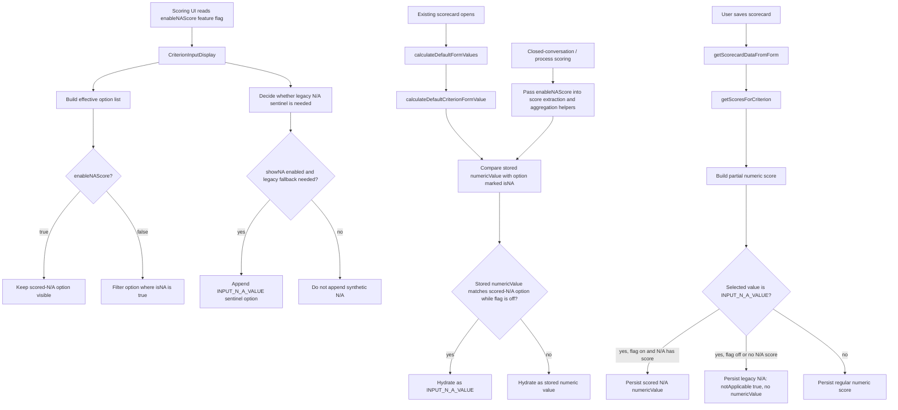

# CONVI-6960: Stored Scored N/A Must Fall Back When `enableNAScore` Is Off

**Created:** 2026-06-01
**Issue:** [CONVI-6960](https://linear.app/cresta/issue/CONVI-6960/scorecard-na-option-inherits-stored-numeric-score-after-enablenascore)
**PR:** [director#19236](https://github.com/cresta/director/pull/19236)

## Investigation

Closed-conversation scoring and scorecard hydration paths were still willing to treat a stored scored-N/A selection as an ordinary numeric option, even after the `enableNAScore` feature flag was disabled.

The result was inconsistent fallback behavior:

- the UI could still surface the stored scored-N/A option
- hydration could reopen scorecards with that numeric option selected
- saving and aggregation could continue to persist and interpret the numeric N/A value instead of converting back to legacy `notApplicable`

## Root Cause

This was an independent feature-flag fallback bug:

1. scoring-side helpers did not consult `enableNAScore`
2. stored scored-N/A values therefore remained numeric through rendering, hydration, submission, and closed-conversation scoring flows even when the flag was off

## Solution

Implemented in `director` on branch `xwang/convi-6960-na-flag-fallback`.

- Kept the fallback logic inside existing scoring files instead of adding standalone helper modules.
- When `enableNAScore` is off:
  - real scored-N/A options are filtered out of the rendered choices
  - the legacy synthetic N/A option is shown instead
  - stored scored-N/A values hydrate as legacy N/A
  - submitted N/A values persist as `notApplicable: true` with no numeric value
- Threaded the flag through existing flows:
  - option rendering
  - score extraction
  - default form hydration
  - process scorecard scoring
  - score save/update flows

## Code Flow Diagram



## Code Walkthrough

The implementation keeps the effective N/A behavior in the existing files that own each path. The important rule is: when `enableNAScore` is off, any stored scored-N/A value is treated as legacy N/A.

### 1. `CriterionInputDisplay.tsx` builds the effective N/A UI

The input renderer reads:

```ts
const enableNAScore = useFeatureFlag('enableNAScore');
```

For labeled radios and dropdown numeric criteria, it removes scored-N/A options from rendered choices when the feature flag is off:

```ts
return options.filter((option) => !checkIsNAOption(option));
```

The same file decides whether to append the synthetic sentinel N/A option:

```ts
return !enableNAScore || getScoredNAOption(criterion) == null;
```

So when the flag is off, scored N/A is hidden and the legacy N/A sentinel is shown instead.

### 2. `scorecard-criterion/utils.ts` handles score labels

`getScoreFromFieldValue` converts form values into saved `Score` objects. It treats either the explicit sentinel or an effective legacy scored-N/A selection as N/A:

```ts
const isFieldValueNA =
  fieldValue[0] === INPUT_N_A_VALUE ||
  isEffectiveLegacyNASelection(criterionTemplate, numericValue, enableNAScore);
```

When `isFieldValueNA` is true, the saved score becomes legacy N/A:

```ts
notApplicable: true,
numericValue: undefined,
```

### 3. `utils.ts` handles save and hydration semantics

`getScorecardDataFromForm` accepts `enableNAScore` and passes it into `getScoresForCriterion`. The numeric score extraction path applies the same feature flag when the user selects the N/A sentinel. If `enableNAScore` is on and the N/A option has a score, it persists the scored-N/A numeric option. Otherwise it persists legacy N/A.

`calculateDefaultCriterionFormValue` handles reopening an existing scorecard. It maps either `score.notApplicable` or a stored numeric value that points at the scored-N/A option while the flag is off to `INPUT_N_A_VALUE`, so a scorecard saved while scored N/A was enabled reopens as legacy N/A after the flag is disabled.

The default hydration functions also accept the flag:

```ts
calculateDefaultFormValues(..., enableNAScore)
calculateDefaultAppealFormValues(..., enableNAScore)
```

Both paths eventually call the same numeric hydration logic with the same flag. This keeps initial form state, score extraction, and appeal hydration consistent.

### 4. Scoring entry points read the feature flag

The scorecard form, save mutation, criterion card body, and process scorecard scoring code now read or receive `enableNAScore` and pass it into the helper layer.

That closes the original gap: closed-conversation scoring no longer interprets stored scored-N/A values as regular numeric selections after the feature flag is turned off.

## Verification

The simplified PR intentionally removes the added test files and does not add new source files. Validation should focus on reviewing the existing paths above and manually exercising:

- opening a scorecard with stored scored-N/A while `enableNAScore` is off
- confirming the UI shows one legacy N/A option, not the scored-N/A numeric option
- saving without changing the selection and confirming the saved score is `notApplicable: true` with no numeric value
- turning the flag on and confirming existing scored-N/A behavior remains unchanged
