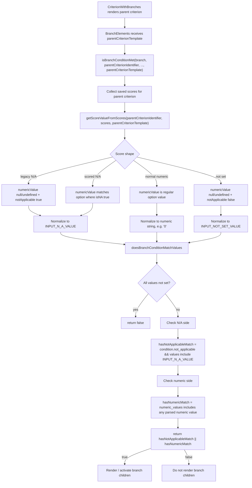

# CONVI-6962: Scored N/A Does Not Activate Branch Conditions

**Created:** 2026-06-01
**Issue:** [CONVI-6962](https://linear.app/cresta/issue/CONVI-6962/na-in-scorecard-branching-from-scored-na-option-does-not-work-in)
**PR:** [director#19237](https://github.com/cresta/director/pull/19237)

## Investigation

Branch activation in scoring was driven by `isBranchConditionMet` in `packages/director-app/src/components/scoring/utils.ts`.

That logic only recognized N/A when the saved score looked like legacy N/A:

- `score.notApplicable === true`
- `score.numericValue === undefined`

Scored N/A does not look like that. It is stored as a normal numeric selection pointing at the option marked `isNA: true`, with `notApplicable === false`.

The same function also returned early when `branch.condition.not_applicable` was set, which meant a branch configured for `N/A + specific numeric values` effectively ignored the numeric side of the condition.

## Root Cause

This was an independent runtime branching bug:

1. Branch evaluation used only legacy sentinel semantics for N/A and had no access to the parent criterion template needed to recognize scored N/A by `isNA`.
2. The evaluation path short-circuited on `not_applicable` instead of OR-ing `not_applicable` with `numeric_values`.

## Solution

Implemented in `director` on branch `xwang/convi-6962-scored-na-branching`.

The fix changes branch evaluation from "read the saved score literally" to "normalize the saved score using the parent criterion template, then evaluate the branch condition."

Before the fix, a scored N/A selection looked like a normal numeric value:

```ts
{
  criterionIdentifier: 'parent',
  numericValue: 2,
  notApplicable: false
}
```

That value could not satisfy `branch.condition.not_applicable` because the old branch matcher only treated legacy N/A as N/A:

```ts
score.numericValue === undefined && score.notApplicable === true
```

After the fix, branch evaluation receives the parent criterion template. That template contains the option metadata:

```ts
{
  value: 2,
  label: 'N/A',
  isNA: true
}
```

`getScoreValueFromScores` now checks the parent template when converting saved scores into branch-match values. If the saved `numericValue` points to an option where `isNA: true`, the helper returns the same internal sentinel used by legacy N/A:

```ts
score.numericValue === scoredNAOption.value -> INPUT_N_A_VALUE
```

That means both forms of N/A now enter branch matching in the same shape:

- legacy N/A: `notApplicable: true`, nullish numeric value -> `INPUT_N_A_VALUE`
- scored N/A: numeric value points to `isNA: true` option -> `INPUT_N_A_VALUE`

The second part of the fix is condition evaluation. The old code returned immediately when `not_applicable` was configured, so a branch configured as "N/A or Yes" would only test the N/A side. `doesBranchConditionMatchValues` now computes both sides:

- `hasNotApplicableMatch`: true when `branch.condition.not_applicable` is enabled and any normalized value is `INPUT_N_A_VALUE`
- `hasNumericMatch`: true when any normalized numeric value is included in `branch.condition.numeric_values`

The branch is active when either side matches:

```ts
return hasNotApplicableMatch || hasNumericMatch;
```

This directly addresses the reported issue because a branch configured for N/A now sees scored N/A as N/A, while mixed branch conditions still activate for their numeric values.

The wiring change is in `CriterionWithBranches.tsx` and `getActiveBranchCriteria`: both now pass the parent criterion template into `isBranchConditionMet`, so runtime branch rendering and active-criteria derivation use the same scored-N/A-aware normalization path.

Legacy behavior is preserved:

- scores with `notApplicable: true` still match N/A branches
- not-set values still do not activate branches
- normal numeric options still match only through `numeric_values`
- numeric radio criteria are not treated as scored-N/A criteria because they do not have per-option `isNA` metadata

## Code Flow Diagram



## Code Walkthrough

The implementation is intentionally kept in the scoring runtime path, not in template-builder utilities.

### 1. Branch rendering passes parent template context

`CriterionWithBranches.tsx` passes both the parent criterion identifier and the full parent criterion template into branch evaluation.

The parent template is first attached to `BranchElements`:

```tsx
<BranchElements
  branches={criterionTemplate.branches}
  parentCriterionIdentifier={criterionTemplate.identifier}
  parentCriterionTemplate={criterionTemplate}
  ...
/>
```

Then each branch-checking path forwards that template into `isBranchConditionMet`:

```ts
isBranchConditionMet(
  branch,
  parentCriterionIdentifier,
  originalScorecard,
  ...,
  parentCriterionTemplate
)
```

That extra argument is the key. The saved score only says `numericValue: 2`; the template is what says value `2` belongs to the option marked `isNA: true`.

### 2. `isBranchConditionMet` gathers the relevant scores

`isBranchConditionMet` in `utils.ts` still owns the existing branch-data selection rules:

- original scorecard scores for normal scorecard rendering
- appeal request or appeal resolve scores in appeal flows
- calibration scores unless the caller excludes calibrated values

For every source, it calls:

```ts
getScoreValueFromScores(parentCriterionIdentifier, scores, parentCriterionTemplate)
```

So every score source goes through the same normalization logic before branch conditions are evaluated.

### 3. `getScoredNAValue` finds the real N/A option

The helper first narrows the template to option-backed criterion types:

```ts
criterionTemplate?.type === CriterionTypes.LabeledRadios ||
criterionTemplate?.type === CriterionTypes.DropdownNumericValues
```

Only those criterion types can have per-option `isNA` metadata. After narrowing, it reads:

```ts
parentCriterionTemplate.settings?.options?.find((option) => option.isNA)?.value
```

This returns the numeric option value for scored N/A, for example `2`.

### 4. `getScoreValueFromScores` normalizes saved scores

For each saved score for the parent criterion, the helper converts the score into the string/sentinel values used by branch matching:

```ts
if (score.numericValue == null) {
  values.push(score.notApplicable ? INPUT_N_A_VALUE : INPUT_NOT_SET_VALUE);
} else if (scoredNAValue != null && score.numericValue === scoredNAValue) {
  values.push(INPUT_N_A_VALUE);
} else {
  values.push(String(score.numericValue));
}
```

There are three important outcomes:

- `numericValue: null` or `undefined` with `notApplicable: true` becomes `INPUT_N_A_VALUE`.
- scored N/A, such as `numericValue: 2` where option `2` has `isNA: true`, also becomes `INPUT_N_A_VALUE`.
- normal numeric values become strings such as `"0"` or `"1"` so they can later be parsed and compared with `branch.condition.numeric_values`.

The nullish check is intentional. Some existing score data can use `numericValue: null`, and treating only `undefined` as missing would incorrectly normalize that value to the string `"null"`.

### 5. `doesBranchConditionMatchValues` evaluates both condition types

The matcher first rejects empty or all-not-set values:

```ts
if (criterionData.length === 0) return false;
if (criterionData.every((value) => value === INPUT_NOT_SET_VALUE)) return false;
```

Then it checks the N/A side:

```ts
const hasNotApplicableMatch = branch.condition.not_applicable
  ? criterionData.some((value) => value === INPUT_N_A_VALUE)
  : false;
```

And independently checks the numeric side:

```ts
const numericValues = criterionData
  .filter((value) => value !== INPUT_N_A_VALUE && value !== INPUT_NOT_SET_VALUE)
  .map((value) => parseFloat(value))
  .filter((value) => !Number.isNaN(value));
const hasNumericMatch = numericValues.some((value) => branch.condition.numeric_values.includes(value));
```

The final result is OR semantics:

```ts
return hasNotApplicableMatch || hasNumericMatch;
```

This is what fixes mixed branch conditions. A branch configured for `N/A + Yes` now activates for N/A or for Yes instead of short-circuiting on only the N/A condition.

### 6. Active branch derivation uses the same path

`getActiveBranchCriteria` also passes the parent criterion template into `isBranchConditionMet`:

```ts
isBranchConditionMet(
  branch,
  criterion.identifier,
  originalScorecard,
  true,
  true,
  isInAppeal,
  undefined,
  appealRequestScorecard,
  appealResolveScorecard,
  appealRequested,
  criterion
)
```

That keeps branch rendering and recursive active-criteria derivation consistent.

## Verification

Targeted regression coverage was added for:

- scored N/A matching an N/A-only branch
- null numeric legacy N/A matching an N/A-only branch
- mixed `not_applicable + numeric_values` conditions using OR semantics

Command run:

```bash
node /Users/xuanyu.wang/repos/director/node_modules/vitest/vitest.mjs run --config /Users/xuanyu.wang/repos/director-convi-6962/packages/director-app/vite.config.mts src/components/scoring/utils.test.ts
```
