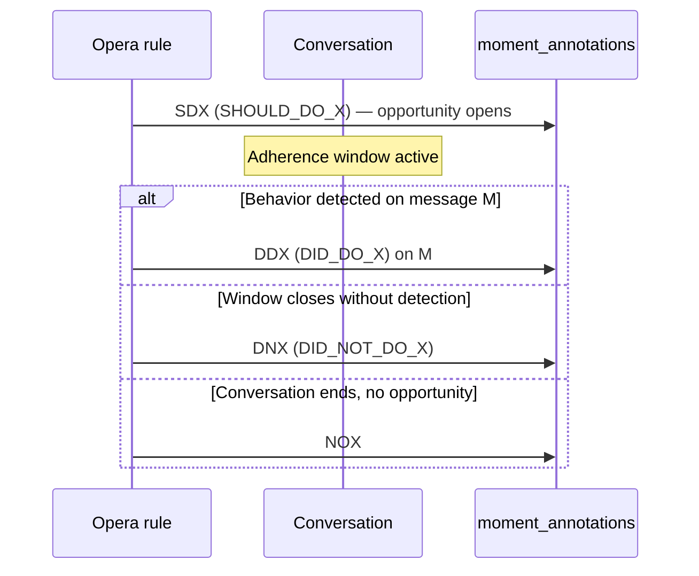

# How annotations are generated (Opera / runtime)

Generation happens in **Opera / policy engine / coach builder** at conversation time. `go-servers` orchestrator persists and post-processes annotations; it does not implement the core adherence window logic.

## Positive behaviors (“should do X”)

Key points:

- **SDX** opens the window when the rule trigger fires (e.g. start of conversation, intent detected).
- **DDX** is emitted on the **specific message** where the behavior was detected.
- **DNX** is emitted as **one annotation** when the window closes without detection — not inferred message-by-message at score time.
- **NOX** is not a fail; it means the agent never had a fair chance.

From PR #27494 author summary:

> DNX is generated when the window for doing the behavior closes, so anyone between SDX and DNX failed to perform the behavior. Whereas DDX is generated when the behavior is done, so it should be directly on the specific message.

## Negative behaviors (“should NOT do X”)

When `BehaviorConfig.negative_adherence_config` is set, Opera uses **negative adherence** tracking. See [synthetic-sdx.md](./synthetic-sdx.md).

From `behavior.proto`:

- If the agent **never** does the forbidden behavior in the window → single **SDX + DDX** pair fired at the SNX position (reward).
- If the agent **does** the forbidden behavior → **SDX + DNX** pair(s) when the violation happens (`record_negative_adherence_once` controls whether only one DNX is recorded).

## Post-processing in go-servers

`orchestrator/internal/nodes/policyengine/post_process_coach_builder_node.go`:

- Dedupes SDX/SNX per conversation or per message depending on config.
- SNX and synthetic SDX (`negative_adherence: true` label) use **per-message** dedup keys.
- DDX/DNX can be dropped if parent SDX was deduped.

## Hints and live coaching

`shared/stateconverter/hint_state_processor.go`:

- Policies with DDX/DNX/NOX/END_OF_ADHERENCE are treated as **finished** for hint purposes.
- **SNX** policies are special: they are removed from the finished set so hints can stay active until a real outcome.

## What AutoQA does *not* do

AutoQA does not walk messages after SDX looking for DDX. It reads pre-existing annotations from the database after the conversation is closed (email: when case status is closed).
