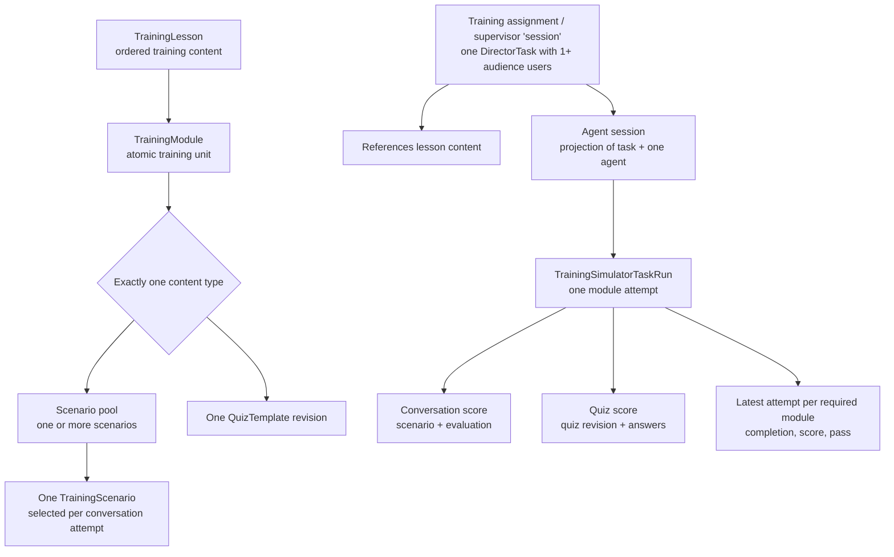
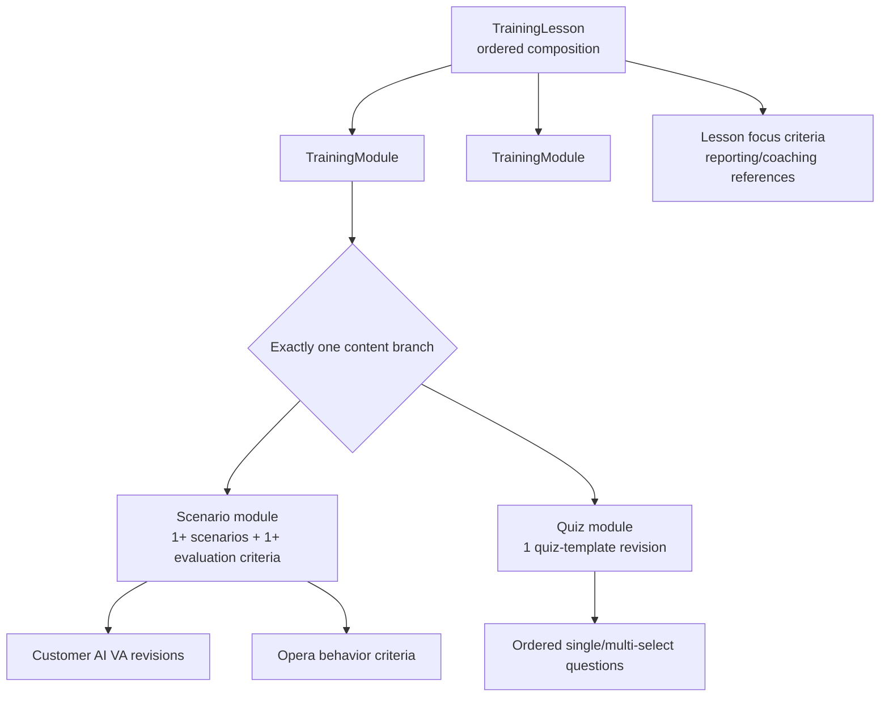
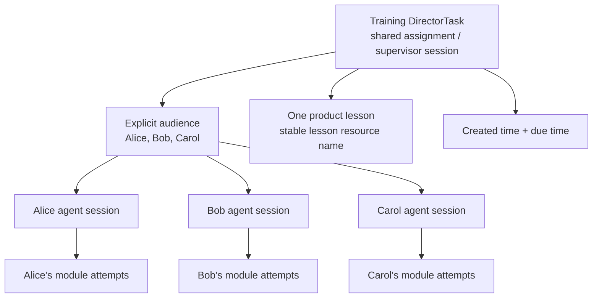
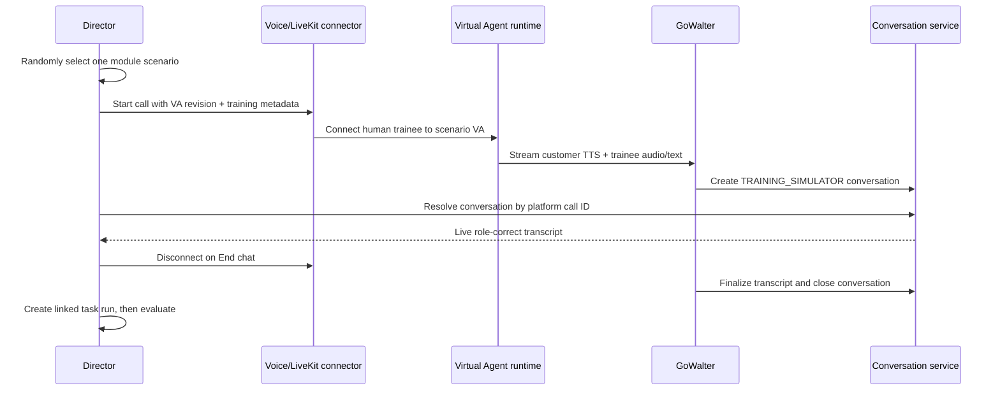
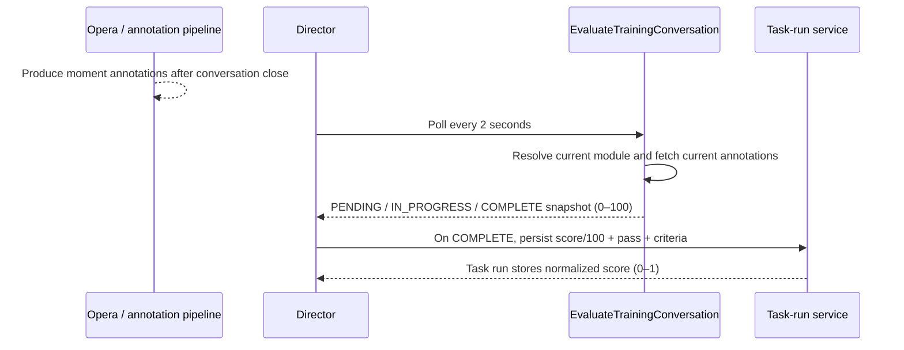

# Training Simulator Domain

Canonical engineering knowledge home and progressive staff-level learning guide for **Training Simulator**. Reviewed topics are expanded here as the walkthrough progresses; the existing domain reference below remains the implementation-oriented source for later topics.

## Staff-Level Learning Guide

| # | Topic | Status |
|---|---|---|
| 1 | [Product context, customer value, and business stage](#1-product-context-customer-value-and-business-stage) | Reviewed |
| 2 | [Domain scope, ownership, and system boundaries](#2-domain-scope-ownership-and-system-boundaries) | Reviewed |
| 3 | [Core vocabulary and invariants](#3-core-vocabulary-and-invariants) | Reviewed |
| 4 | [End-to-end lifecycle: authoring → assignment → simulation → evaluation → reporting](#4-end-to-end-lifecycle) | Reviewed |
| 5 | [Training content: lessons, modules, scenarios, criteria, and quizzes](#5-training-content) | Reviewed |
| 6 | [Assignment and session model](#6-assignment-and-session-model) | Reviewed |
| 7 | [Simulation runtime and Customer AI](#7-simulation-runtime-and-customer-ai) | Reviewed |
| 8 | [Evaluation, scoring, pass/fail, and N/A semantics](#8-evaluation-scoring-passfail-and-na-semantics) | Reviewed |
| 9 | Reporting and metric correctness | Next |
| 10 | Architecture, service boundaries, and reused platforms | Planned |
| 11 | Storage, contracts, revisioning, and historical consistency | Planned |
| 12 | Authorization, privacy, and tenant isolation | Planned |
| 13 | Reliability, observability, and failure diagnosis | Planned |
| 14 | Performance, scale, cost, and external dependencies | Planned |
| 15 | Testing, rollout, feature flags, and safe migrations | Planned |
| 16 | Codebase navigation across backend, frontend, proto, and AI services | Planned |
| 17 | Current technical risks, open questions, and GA roadmap | Planned |
| 18 | Staff-engineer decision framework: tradeoffs, reviews, and domain evolution | Planned |

### Current design work

CONVI-7583 now has [go-servers#31780](https://github.com/cresta/go-servers/pull/31780) open from `/Users/xuanyu.wang/repos/go-servers-convi-7583` (`xw/convi-7583-session-reporting-backend`). It makes assignments and each matched task's full stored audience the reporting root, reuses task-run List parsing/enrichment through an internal method with configurable page size and a 100,001-row reporting overflow probe, counts every assigned-agent task run within the session before deterministic latest-attempt reduction, handles conversation and quiz outcomes, excludes stale modules from completion/score/pass calculations while retaining their latest runs, and returns unavailable aggregates as zero plus `not_applicable`. Existing request user/group fields remain task selectors through `ListDirectorTasks`; they do not project a matched task's audience down to those users, and an empty resolved audience means no task-audience filter. Current Director callers do not require `direct_team_only`, while row-level ACL and agent self-scope remain separate work. The rebased branch uses main's cresta-proto v2.21.28. Go and Bazel package tests, Gazelle, vet, formatting, and diff checks pass; repository lint remains blocked because the installed golangci-lint was built with Go 1.24 while the repository targets Go 1.25.

The 2026-08-31 Director/Figma revalidation narrowed the remaining visible Milestone 1 data work to two additions: the unique count of assigned agents with at least one incomplete visible session and per-agent attempt count in the session drawer. Director can derive the incomplete count from its existing assignment/audience join and per-agent statuses. Attempt count cannot be reconstructed from the response's latest-per-module `task_runs`, so `AgentPerformanceEntry.attempt_count` remains the only new protobuf datum and is available in the open, green [cresta-proto#9716](https://github.com/cresta/cresta-proto/pull/9716). The drawer already shows backend-derived Passed/Failed/Incomplete plus score; a historical per-agent attempt pass rate is not current Milestone 1 scope unless Product defines its denominator separately.

**Decision update (2026-08-27):** After discussion with Jack Jee, reporting will treat incomplete timeout, completed all-criteria-N/A, and completed failure as the same result when stored as `score = 0` and `passed = false`. Criterion-level N/A remains meaningful and is excluded from scoring; applicable criteria still determine score/pass. Separate persisted overall evaluation status and N/A fields are no longer required for this purpose, superseding the premise of CONVI-7582. The supplied message excerpt explicitly validates the all-N/A/failure collapse but does not itself discuss timeouts. Proto PR #9656, backend PR #31521, and Director PR #22107 were closed with decision context; Linear cleanup remains pending. See [the decision record](decisions/2026-08-27-collapse-overall-zero-false-results.md).

Milestone 2 lesson reporting has isolated handwritten proto, backend, and Director implementations on `codex/milestone-2-lesson-reporting` worktrees. Its original `ListTrainingLessons` transport is now superseded: the proto PR must expose `RetrieveTrainingSimulatorLessonStats`, and the backend/Director work must be rebased to that dedicated batch API. Assignment-rooted aggregation, latest-attempt-first classification, and the no-per-row-request rule remain unchanged. See [the API decision](decisions/2026-08-28-dedicated-lesson-module-stats-apis.md) and [the PR-update prompts](deliverables/milestone-2-3-dedicated-stats-proto-prompts.md).

The lesson/module statistics API boundary closed on 2026-08-28 with dedicated batch APIs selected: `RetrieveTrainingSimulatorLessonStats` and `RetrieveTrainingSimulatorModuleStats`. The earlier list-extension direction optimized away one frontend request, but the Slack review prioritized clearer responsibility, convention, discoverability, and independent reporting authorization/failure/latency behavior once cold-tab performance was not considered a major concern. Director will issue one batch stats request for the loaded content page and mitigate cold switching with caching/prefetch; it must still avoid per-row requests and measure cold/cached behavior. The aggregation source and reporting semantics are unchanged. See [the accepted decision](decisions/2026-08-28-dedicated-lesson-module-stats-apis.md).

The CONVI-7601 module and CONVI-7600 lesson contracts are now published on their PR branches around dedicated ordered batch statistics APIs. Both content list APIs are restored, both reporting requests accept only ordered content names plus an optional time range, and both use admin/reporting roles without agent/group/team filters. Lesson results expose distinct assigned-session count, passed/total assignment counts, normalized average plus availability count, and one shared module-statistics entry for every current lesson module in content order. The lesson branch is one clean commit `6fa5404349` on final module head `97873e3108`; its PR metadata still needs follow-up, and the prepared backend/Director implementations require transport and field-name rework.

## 1. Product Context, Customer Value, and Business Stage

### Product thesis

Traditional role-play requires a manager or trainer to act as the customer. That approach is expensive, inconsistent, and difficult to scale or repeat. Training Simulator replaces that bottleneck with scenario-based practice against an AI-simulated customer and automatically evaluates the interaction using the same Opera / AutoQA quality language used for live conversations.

The differentiated product loop is:

> desired behavior → safe practice → consistent evaluation → targeted coaching

This is not primarily a voice-bot feature. It is a repeatable practice-and-measurement system attached to QM & Coach.

### Users and customer value

- **Agents** run assigned practice sessions and review their results.
- **Supervisors, QA administrators, and training leaders** author content, assign sessions, monitor completion, and diagnose performance.

Customer value has three layers:

1. **Scalable practice:** agents can rehearse without requiring a human counterpart for every attempt.
2. **Consistent assessment:** configured criteria produce repeatable, evidence-based results rather than subjective role-play feedback.
3. **Actionable learning signals:** completion, scores, attempts, and missed behaviors can inform coaching and content improvement.

The strategic advantage of fitting inside QM & Coach is a shared definition of quality across training and production. The same connection also creates coupling: evaluation or scorecard changes can affect both product areas and must preserve their respective semantics.

### Shipped product and business stage

The initial product is a minimum end-to-end vertical slice: content creation → assignment → simulation → evaluation → session-level reporting.

Training Simulator launched on July 9, 2026 as a Limited Availability paid add-on. The recorded launch context names Mutual of Omaha and Snap Finance as initial beta customers, with expanded beta planned for early Q3 and GA targeted for late Q3 2026. Expansion and GA dates are roadmap targets, not completed facts; access is gated through `enableTrainingSimulator`.

Product maturation toward GA includes lesson/module diagnostics, quizzes, richer Customer AI capabilities, permission hardening, historical reporting correctness, and operational readiness. CSV export and some deeper analytics appear in exploratory designs but are not established commitments.

### Staff-engineer framing

The product succeeds only if the full learning loop is trustworthy. Conversation realism, stable content history, evaluation correctness, separation from production analytics, consistent metric semantics, and actionable reporting are product requirements—not merely implementation details.

A technically successful conversation that produces an untrustworthy score is a product failure. Accurate scores that do not help managers improve coaching or content also deliver limited value.

The central staff-level question is:

> Can customers trust this system to improve agent readiness at scale, and can we demonstrate that improvement?

**Sources:** [Coaching Training Simulator PRD](https://coda.io/d/_ddKtmYQWQVC/Coaching-Training-Simulator-PRD_suAmSoxf), [Training Simulator engineering design](https://docs.google.com/document/d/1GCeE9XCAVcgetOhYWPvqZJ3hp3qeVhK5YMk4rBkWmd4/edit), [SE enablement deck](https://docs.google.com/presentation/d/1lY6UOohDrUn7zxcW_DgfNpq0rvz9z_zz0ZfNJSVktgg/edit?slide=id.g3f0842e9369_0_277#slide=id.g3f0842e9369_0_277), [domain setup research](sessions/2026-08-09/claude-training-simulator-domain-setup.md), and [reporting requirements brief](deliverables/lesson-module-statistics-reporting.md).

## 2. Domain Scope, Ownership, and System Boundaries

### Ownership model

Training Simulator owns the complete training outcome and the training-specific semantics connecting:

> content → assignment → simulation → evaluation → reporting

It does not own every platform used to implement that flow. The domain owns integration correctness and end-to-end invariants; shared platform teams own their reusable mechanisms.

| Capability | Training Simulator owns |
|---|---|
| Training content | Lessons, modules, scenarios, quizzes, evaluation configuration, and lifecycle |
| Assignment | Turning a lesson into per-agent work and defining training-session state |
| Attempt identity | Connecting agent, assignment, lesson, module, scenario, conversation, and outcome |
| Simulation integration | Starting the correct Customer AI and identifying the resulting interaction as training |
| Evaluation orchestration | Requesting evaluation and translating its result into training outcomes |
| Reporting | Completion, score, pass rate, attempt, latest-attempt, and N/A semantics |
| Product access | Which personas may author, assign, attempt, or inspect training |

### Shared platforms and explicit non-ownership

| Shared platform | Training Simulator consumes | Outside this domain |
|---|---|---|
| DirectorTask | Assignment, audience, schedule, and task lifecycle | Generic task infrastructure |
| Coaching Plan | Agent entry point for assigned sessions | General coaching workflows |
| Virtual Agent / LiveKit | AI-customer runtime and media transport | Generic VA, media, STT/TTS, and vendor operations |
| GoWalter | Transcript persistence and speaker-role mapping | General conversation ingestion |
| Opera | Behavior and moment detection consumed by the module evaluator | Generic policy engine and rule execution |
| AutoQA / scorecards | Shared quality vocabulary and lesson focus references; the current module evaluator does not invoke the scorecard scoring engine | General scorecard semantics |
| Analytics | Shared filters and potential reporting infrastructure | Generic analytics APIs and PG→ClickHouse mechanics |
| Notifications | Training-task notification requests | Notification delivery mechanics |

Out of scope does not mean irrelevant. These systems are dependencies with contracts and coordination requirements, but Training Simulator should not fork or redefine their generic behavior.

### Repository map

| Repository | Role in the domain |
|---|---|
| `go-servers` | Primary backend, persistence, evaluation orchestration, and GoWalter integration |
| `cresta-proto` | Public entities, RPCs, enums, and cross-service contracts |
| `director` | Supervisor and agent product experiences |
| `python-ai-services` | Voice-agent runtime participating in simulated conversations |

The boundary is semantic rather than repository-shaped. One product change can cross all four repos, while each repo contains capabilities outside Training Simulator.

### Critical contracts at the boundaries

1. **Content → assignment:** preserve the exact lesson/module revisions intended for the assignee so later edits do not rewrite history.
2. **Assignment → runtime:** carry agent, task/session, lesson, module, scenario, attempt, and revision identity into the run.
3. **Runtime → conversation platform:** mark the conversation as `TRAINING_SIMULATOR` and preserve the reversed role model: human is agent, AI is customer.
4. **Conversation → evaluation:** preserve applicable policies, asynchronous readiness, evidence, score, pass, auto-fail, and N/A outcomes.
5. **Evaluation → reporting:** define latest/best attempt, required modules, incomplete work, never-started agents, N/A values, revision history, and score normalization explicitly.
6. **Every boundary → authorization:** maintain customer isolation and persona-appropriate access rather than trusting caller-supplied filters.

### Staff-engineer framing

Staff-level ownership means defending invariants across repositories and teams, sequencing compatible contract changes, involving the correct platform owners, making failures attributable to the right boundary, and preventing training-specific exceptions from corrupting production behavior.

The useful mental model is:

> Training Simulator owns the outcome and integration correctness; platform teams own the reusable mechanisms.

**Sources:** [project registry](project.yaml), [Training Content](subdomains/training-content/README.md), [Assignment and Session](subdomains/assignment-and-session/README.md), [Simulation Runtime](subdomains/simulation-runtime/README.md), [Evaluation](subdomains/evaluation/README.md), and [Reporting](subdomains/reporting/README.md).

## 3. Core Vocabulary and Invariants

### Domain model



| Term | Precise meaning |
|---|---|
| **Training lesson** | Reusable content: an ordered collection of modules with lesson-level metadata and focus criteria. It is not an assignment or execution record. |
| **Training module** | The atomic unit an agent must complete. It contains exactly one content type: one-or-more scenarios or one quiz. It also carries evaluation/pass configuration. |
| **Training scenario** | A customer situation backed by a specific Customer AI virtual-agent configuration and revision. A module may expose a pool of scenarios. |
| **Quiz template** | Versioned question content used as the exclusive content of a quiz module; a submitted attempt produces a quiz score and per-question results. |
| **Training assignment / supervisor session** | One `DIRECTOR_TASK_TYPE_TRAINING_SIMULATOR` DirectorTask containing an explicit audience of one-or-more users, lesson content, and a due time. |
| **Agent session** | One assignee's progress projection within a shared training DirectorTask: `(task, agent)` plus that agent's module attempts and outcome. It is not a separate DirectorTask. |
| **Task run / attempt** | The durable execution fact for one agent attempting one module within one assignment. It binds task, lesson, module, agent, revisions, and a subtype outcome. |
| **Conversation attempt** | A task run backed by one training conversation using one selected scenario. The human is the agent and the AI is the customer. |
| **Evaluation config** | Module rules defining criteria, weights, passing score, auto-fail behavior, allowed attempts, and maximum conversation turns. |
| **Criterion result** | The outcome for one configured behavior, including pass/N/A state, weight, auto-fail state, and supporting evidence. |
| **Task stats** | Reporting projection over assignments and task runs; it is not itself an execution entity or source of truth for content. |

### Things that must not be conflated

| Common confusion | Correct distinction |
|---|---|
| Lesson vs session | A lesson is reusable content. The supervisor's session/assignment is a shared DirectorTask; an agent session is one user's projection within it. |
| Module vs scenario | A module is the assessed training unit. A scenario is one possible simulated-customer situation for that unit. |
| Scenario pool vs sequence | The pool provides alternatives. The frontend selects one scenario per conversation attempt; the agent does not need to complete every scenario. |
| Session vs conversation | A session spans a lesson and can contain many module attempts. A conversation represents one conversational module attempt. |
| Attempt vs official score | Every run is historical evidence; current reporting uses the latest attempt for each task + lesson + module + agent key. |
| Complete vs passed | Complete means all required modules have outcomes. Passed additionally means every required module passed. |
| Criterion N/A vs overall result | An N/A criterion remains meaningful and is excluded from scoring. The special overall all-criteria-N/A result is intentionally reported like failure when stored as zero/false. |
| Archived vs deleted history | Archive controls future availability. Historical assignments and results still require the exact content/revisions used at execution time. |

### Independent state machines

The word “status” is overloaded. Callers must identify which state machine they mean.

| State machine | Representative states | Meaning |
|---|---|---|
| Content lifecycle | `ACTIVE`, `ARCHIVED` | Whether a lesson/module/scenario is available for future use |
| DirectorTask lifecycle | `DRAFT`, `ACTIVE`, `DELETED`, `ARCHIVED` | Administrative lifecycle of the assignment record |
| Agent progress | not started, in progress, complete, overdue | How far the assignee has progressed through required modules |
| Agent completion | `INCOMPLETE`, `COMPLETE` | Whether every required module has a completed outcome |
| Pass outcome | passed / failed | Whether completed work met every required module's pass rule |
| Evaluation lifecycle | `PENDING`, `IN_PROGRESS`, `COMPLETE` | Whether asynchronous criterion evaluation is ready |

For example, an evaluation can be `COMPLETE` while the lesson session remains incomplete because other modules have not been attempted.

### Invariants to memorize

1. **Content is not execution.** Lessons/modules/scenarios are reusable definitions; DirectorTasks, task runs, conversations, and quiz scores record execution.
2. **Ordering matters.** A lesson is an ordered module composition, and agents progress through required modules in order.
3. **One conversation attempt uses one scenario.** The module can contain a scenario pool, but passing does not require passing every scenario in that pool.
4. **One task run represents one module attempt.** Conversation and quiz outcomes are different subtypes attached to the same base attempt identity.
5. **Historical identity must be revision-safe.** Stable names alone are insufficient when content changes. Assignments and runs must preserve the content revisions used; assignment snapshot completion remains a known correctness prerequisite.
6. **Latest attempt is the current reporting answer.** Keep all attempts for audit/improvement analysis, but session statistics currently select the latest attempt per task, lesson, module, and agent.
7. **Completion and pass are separate.** An agent is complete only after every required module has an outcome; the agent passes only when complete and every required module passed.
8. **Criterion N/A remains a separate semantic state.** Exclude N/A criteria from scoring; if all criteria are N/A, reporting intentionally accepts the persisted zero/false result as failure-equivalent.
9. **Score units change across contracts.** Module configuration and direct evaluation use 0–100; task-run/task-stats representations use normalized 0–1 values. Conversion must happen once at an explicit boundary.
10. **Training traffic stays isolated.** Training conversations use `ConversationSource.TRAINING_SIMULATOR` and must not affect live-agent progression or production analytics.
11. **Participant roles are reversed from normal voice-agent traffic.** The human trainee is the agent; the simulated Customer AI is the visitor/customer. Speaker mapping must preserve that meaning through persistence and evaluation.
12. **Resource scope is part of identity.** Customer/profile-qualified resource names and authorization checks must remain aligned across every linked entity.

### Staff-engineer framing

These invariants form the domain's compatibility contract. A change that preserves RPC shape but changes the meaning of session, latest attempt, required module, N/A, score scale, or participant role is a breaking change even if the compiler and tests remain green.

When reviewing a design, ask which entity is authoritative, which revision it refers to, which state machine is changing, and whether the metric still means the same thing for historical and in-flight sessions.

**Sources:** [lesson contract](/Users/xuanyu.wang/repos/cresta-proto/cresta/v1/trainingsimulator/training_lesson.proto), [module and evaluation-config contract](/Users/xuanyu.wang/repos/cresta-proto/cresta/v1/trainingsimulator/training_module.proto), [scenario contract](/Users/xuanyu.wang/repos/cresta-proto/cresta/v1/trainingsimulator/training_scenario.proto), [task-run contract](/Users/xuanyu.wang/repos/cresta-proto/cresta/v1/trainingsimulator/training_simulator_task_run.proto), [evaluation contract](/Users/xuanyu.wang/repos/cresta-proto/cresta/v1/trainingsimulator/evaluation.proto), [stats contract](/Users/xuanyu.wang/repos/cresta-proto/cresta/v1/trainingsimulator/stats.proto), [DirectorTask training contract](/Users/xuanyu.wang/repos/cresta-proto/cresta/v1/coaching/task.proto), [current stats implementation](/Users/xuanyu.wang/repos/go-servers/apiserver/internal/trainingsimulator/action_retrieve_training_simulator_stats.go), [Training Content](subdomains/training-content/README.md), [Assignment and Session](subdomains/assignment-and-session/README.md), and [Reporting](subdomains/reporting/README.md).

## 4. End-to-End Lifecycle

### Lifecycle at a glance

```mermaid
sequenceDiagram
    participant S as Supervisor / Director
    participant A as Assignment / Coaching
    participant U as Agent / Director
    participant V as Voice Agent + LiveKit
    participant G as GoWalter / Conversation
    participant E as Opera + Training Evaluation
    participant R as Reporting

    S->>S: Author scenario, module, lesson
    S->>A: Assign lesson + audience + due date
    A-->>U: Surface assigned session
    U->>U: Select next module and one scenario
    U->>V: Join voice session with training metadata
    V->>G: Stream transcript and call lifecycle
    G-->>U: Create/resolve TRAINING_SIMULATOR conversation
    U->>A: Create task run linking conversation to assignment/content
    U->>G: End call; GoWalter closes conversation
    U->>E: Poll EvaluateTrainingConversation
    E->>G: Read moment annotations
    E-->>U: Pending / in progress / complete verdict
    U->>A: Persist normalized score, pass, and criteria
    A->>R: Aggregate latest required-module attempts
    R-->>S: Session and agent results
```

### Stage-by-stage data flow

| Stage | Trigger and owner | Durable effect | Critical handoff |
|---|---|---|---|
| 1. Author content | Supervisor uses Lesson Configuration | Versioned scenarios, modules, lessons, criteria, and quizzes | Scenario creation also materializes Customer AI virtual-agent revisions |
| 2. Assign lesson | Supervisor selects lesson, audience, name, and due date | Active training `DirectorTask` with audience/content/schedule config | Coaching/assignment infrastructure turns reusable content into agent work |
| 3. Discover session | Agent opens Assigned Training Sessions in Coaching Plan | No new execution record yet | UI must load the assignment's intended content and current progress |
| 4. Start module | Agent starts the next module | Frontend selects one scenario and creates a platform call ID | Training metadata and VA revision must reach the voice runtime intact |
| 5. Run simulation | Voice Agent and GoWalter run the call | GoWalter creates the training conversation and persists transcript/messages | Human/AI speaker roles and `TRAINING_SIMULATOR` source must be correct |
| 6. Create attempt | Director resolves the GoWalter-created conversation | `TrainingSimulatorTaskRun` links conversation, task, content, scenario, revisions, and agent | A call can exist before its task run; retry/idempotency guards matter |
| 7. Close and evaluate | Call disconnects; GoWalter closes conversation; Director starts polling | Opera annotations become available; evaluator returns partial or complete criterion results | Conversation close, annotation readiness, and evaluation completion are eventually consistent |
| 8. Persist verdict | Evaluation reaches complete or the terminal timeout path | Score is normalized 0–100 → 0–1 and pass/criteria are written to the attempt outcome | Evaluation success and verdict persistence are separate failure domains |
| 9. Progress or retry | Results refetch after the attempt update | UI unlocks progress or allows another attempt | Configured attempt limits and official latest-attempt semantics must agree |
| 10. Report | Supervisor loads Training Sessions/reporting | Assignment cohorts join to latest attempts for required modules | Never-started agents, stale modules, N/A, and incomplete work must retain correct denominators |

### 1. Authoring materializes runtime dependencies

Supervisors create scenarios, modules, and lessons before assignment. A scenario is not only a database row: creation first asks the Virtual Agent platform to create an umbrella VA and a `SINGLE_PROMPT_SUB_VA`, then stores the resulting revision with the scenario. Modules bind scenario/quiz content and evaluation configuration; lessons order modules.

This crosses a transaction boundary. VA creation is remote and happens before the scenario batch is inserted into the application database, so failure recovery must consider orphaned VA revisions or a database write that did not follow a successful remote side effect.

### 2. Assignment turns content into scheduled work

Director creates an active `DIRECTOR_TASK_TYPE_TRAINING_SIMULATOR` task containing:

- audience user resource names;
- a training lesson resource name;
- use-case context;
- a display name; and
- a due time.

The assignment/session is the execution container. The lesson remains reusable content. The current contract stores an explicit list of user resource names in one DirectorTask; the product UI may create a single-agent or multi-agent assignment. Reporting must begin from task/audience facts so agents who never start are not lost.

### 3. Launch selects one concrete runtime path

The agent sees the session in Coaching Plan, enters the next module, and the frontend selects one random scenario from the module's pool. On Start, Director creates a platform call ID and sends lesson, module, scenario, agent, and VA revision metadata into the voice call.

Director deliberately does **not** pre-create the conversation. GoWalter owns conversation creation after the call connects; Director later resolves that conversation from the platform call ID.

### 4. Runtime creates the training conversation

The Python Voice Agent loads the selected VA revision and builds the LiveKit/STT/LLM/TTS pipeline. GoWalter persists messages, owns call close, assigns the training conversation source, and applies the role/channel swap so the human remains the agent and Customer AI remains the visitor.

This stage must preserve identity across two IDs: the frontend-generated platform call ID and the eventual conversation resource name.

### 5. The task run is created after conversation resolution

When the conversation name appears, Director creates one task run containing the conversation, DirectorTask, lesson, module, scenario, and agent resource names. A per-conversation guard prevents repeated renders or stale state from creating duplicate attempts.

This is an eventual handoff rather than one atomic transaction. A connected or completed conversation can exist without a successfully persisted task run; the UI therefore distinguishes attempt-creation failure from evaluation and verdict-save failure.

Quiz modules take a shorter branch: submission creates the base task run and quiz-specific score/question results without the LiveKit, conversation, Opera-annotation, or conversation-evaluation stages.

### 6. Conversation close unlocks asynchronous evaluation

Ending the voice call causes GoWalter to close the conversation server-side. That close allows annotation generation to finalize. Once the conversation is locally marked ended and the task run exists, Director polls `EvaluateTrainingConversation`.

The evaluator:

1. resolves the task run by conversation;
2. resolves the module and evaluation config;
3. fetches available moment annotations for configured behaviors;
4. returns `PENDING`, `IN_PROGRESS`, or `COMPLETE` criterion results;
5. excludes N/A criteria from the weighted denominator;
6. applies the passing threshold and auto-fail rules.

Partial evaluation results are valid progress snapshots, not final verdicts.

### 7. Evaluation and persistence are separate commits

When evaluation reaches `COMPLETE`, Director converts the 0–100 result to the task-run's normalized 0–1 representation and updates score, pass, and criterion results. A failed update can therefore leave a conversation with a computable evaluation but no persisted official verdict; the UI has a dedicated retry-save path.

This split means idempotency must be reasoned about separately for task-run creation, evaluation polling, and verdict persistence.

### 8. Progress and reporting derive from attempts

The UI refetches task runs after the verdict save. The agent proceeds through ordered modules or retries a failed/lost attempt. Although `allowed_number_attempts` exists in module configuration, the current conversation pipeline identifies it as a future enforcement hook; configuration and enforcement must not be assumed equivalent.

Session reporting starts from training assignments, joins their task runs and subtype outcomes, selects the latest attempt for each task + lesson + module + agent, restricts completion/scoring to required modules, and then computes agent completion, pass, score, and task aggregates.

### Staff-engineer framing

This lifecycle is a distributed saga, not a single transaction. The most important review questions are:

- Which durable artifact proves each stage succeeded?
- What happens if the next stage never runs?
- Can a retry duplicate a VA, conversation, task run, evaluation, or verdict?
- Can support identify the workflow using task, platform-call, conversation, and task-run IDs?
- Are historical content revisions and metric semantics preserved after content edits?
- Does partial success remain visible and recoverable without corrupting reporting?

**Sources:** [scenario/VA creation](/Users/xuanyu.wang/repos/go-servers/apiserver/internal/trainingsimulator/action_batch_create_training_scenarios.go), [assignment construction](/Users/xuanyu.wang/repos/director/packages/director-app/src/features/training-simulator/assign-training-session-modal/hooks/useAssignTrainingSession.ts), [scenario selection](/Users/xuanyu.wang/repos/director/packages/director-app/src/features/training-simulator/simulation/lessonUtils.ts), [voice metadata](/Users/xuanyu.wang/repos/director/packages/director-app/src/features/training-simulator/simulation/api/buildTrainingVoicePlatformParams.ts), [conversation lifecycle](/Users/xuanyu.wang/repos/director/packages/director-app/src/features/training-simulator/training-conversation/TrainingConversationRun.tsx), [attempt/evaluation pipeline](/Users/xuanyu.wang/repos/director/packages/director-app/src/features/training-simulator/training-conversation/useModuleEvaluationPipeline.ts), [training evaluator](/Users/xuanyu.wang/repos/go-servers/apiserver/internal/trainingsimulator/action_evaluate_training_conversation.go), [task-run creation](/Users/xuanyu.wang/repos/go-servers/apiserver/internal/trainingsimulator/action_create_training_simulator_task_run.go), [stats aggregation](/Users/xuanyu.wang/repos/go-servers/apiserver/internal/trainingsimulator/action_retrieve_training_simulator_stats.go), and the five [subdomain references](subdomains/).

## 5. Training Content

### Content hierarchy and authoring intent



The hierarchy expresses two different authoring concerns:

- a **lesson** defines the training journey and ordering;
- a **module** defines one assessable unit and exactly one interaction type.

The backend rejects modules containing both scenarios and a quiz, and rejects modules containing neither. Director additionally requires at least one evaluation criterion for a scenario module. Quiz modules do not carry hidden scenario criteria.

### Entity responsibilities

| Entity | Owns | Does not own |
|---|---|---|
| `TrainingLesson` | Stable ID, revision, title, description, use case, ordered module IDs, focus-criterion references, active/archive state | Assignment audience, due date, attempts, session result |
| `TrainingModule` | Stable ID, revision, display name, description, exclusive scenario-or-quiz content, evaluation/pass configuration, active/archive state | Agent/session identity or official attempt history |
| `TrainingScenario` | Stable ID, revision, title, context, visitor objective, opening message, VA ID/revision, state | Module pass threshold or assignment state |
| `EvaluationCriterion` | Stable criterion ID, Opera behavior ID, display name, weight, auto-fail flag | Behavior implementation/lifecycle or moment-generation logic |
| `QuizTemplate` | Stable template ID, revision, title, description, ordered questions and answer keys | Session aggregation semantics or conversation evaluation |
| `LessonFocusCriterion` | Scorecard-template and criterion reference used to describe/track lesson focus | Module-level evaluation configuration |

### Lessons: composition, not execution

A lesson references existing modules in order; module creation is a separate operation. The backend validates that referenced modules belong to the same customer/profile. Director currently constrains the authoring form to one through three modules.

Lesson focus criteria pair a scorecard-template resource with a criterion ID. They describe the behaviors the lesson is intended to improve and support tracking/reporting, but they do not replace each module's evaluation config.

Saving a lesson inserts a new revision row under the same stable lesson ID. Its `training_module_ids` preserve order, but they contain stable module IDs rather than module revision IDs. A consumer that simply expands them to “latest” can therefore observe later module edits unless the assignment/run pins revision intent.

### Modules: the assessment boundary

Every module is one of two types:

1. **Scenario module:** one-or-more Customer AI scenarios plus one-or-more Opera behavior criteria.
2. **Quiz module:** exactly one committed quiz-template revision; scenario criteria are empty.

Common configuration includes a 0–100 passing grade, allowed-number-of-attempts, and—for conversation modules—a maximum-turn limit. The presence of a configuration field does not prove every runtime path enforces it; attempt-limit enforcement remains a known example.

Creating or updating a module may orchestrate child writes first:

- inline unnamed scenarios are created;
- named scenarios are revised;
- an inline quiz is committed as a new template or new revision;
- the module revision is then inserted with the resulting child references.

An update request is the complete replacement content for the module. Omitting a prior scenario unlinks it from the new module revision; it does not by itself erase the scenario's historical revisions.

### Scenarios: authored content with runtime side effects

A scenario supplies the customer situation:

- title;
- background/context;
- visitor objective;
- initial visitor message; and
- active/archive state.

Those fields are compiled into Customer AI configuration. Creation materializes an umbrella VA and a `SINGLE_PROMPT_SUB_VA`. Updating any VA-affecting field or the scenario state creates new VA revisions; a metadata-only no-op can carry the existing VA revision forward.

Scenario persistence is append-only, but VA creation/update is a remote side effect. The two systems do not share a database transaction, so authoring needs idempotency, orphan detection, and repair/cleanup thinking.

At runtime, one scenario is randomly selected from a scenario module's pool. Scenario diversity improves practice coverage, but it also introduces cohort variance: agents can receive different difficulty distributions while being reported under the same module.

### Evaluation criteria: references to shared behavior definitions

A scenario-module criterion contains:

- a stable criterion ID inside the module;
- an Opera **behavior ID**;
- a display name;
- a positive weight; and
- an `auto_fail` flag.

Despite a stale proto comment calling `behavior_id` an Opera rule ID, the implementation resolves it as a behavior. The distinction matters because policy changes propagate into behavior state and annotations.

The criterion is a reference, not a snapshot of Opera's behavior implementation. Deactivation, archive, deletion, product-area applicability, or semantic changes in the referenced behavior can therefore change whether future attempts are evaluable. Authoring surfaces must reveal broken/inactive references, and runtime policy selection must enforce whether a behavior applies to Training Simulator before annotations are produced.

### Quizzes: independently revisioned content

A quiz template is revisioned independently and a quiz module pins a specific quiz-template revision. Questions are ordered and currently support single-select and multi-select answer models with option IDs and answer keys; image metadata is also preserved by the contract.

Committing a quiz creates the template revision and all question snapshots in one database transaction. A module save is a separate operation, however, so a successful quiz commit followed by a failed module write can leave an unreferenced quiz revision.

The current Director editor exposes question weight and auto-fail controls, but the current quiz-question contract does not persist those fields; reopening resets them to defaults. This is tracked as a contract gap rather than durable semantics. Quiz pass calculation and its alignment with module/session reporting also require explicit, shared rules. Backend authoring/outcome support exists, while the tracked Director runtime still describes the trainee quiz experience as feature-gated scaffolding rather than a generally reachable flow.

### Revision model and historical correctness

Lessons, modules, scenarios, and quiz templates use stable resource IDs plus append-only revision IDs. Each save inserts a new revision; list/read paths generally identify the latest revision by `created_at`.

| Relationship | Persisted reference | Historical implication |
|---|---|---|
| Lesson → modules | Ordered stable module IDs | Expanding to latest modules can change lesson meaning over time |
| Module → scenarios | Stable scenario IDs | Expanding to latest scenarios can change runtime behavior over time |
| Module → quiz | Quiz template ID + revision ID | Quiz content is explicitly pinned |
| Scenario → VA | VA ID + VA revision ID | Runtime persona can be reproduced if the scenario revision is retained |
| Task run → content | Lesson/module revisions and optional scenario revision | Attempt evidence can be tied to specific content |
| DirectorTask → lesson | Stable lesson name in the current contract | Assignment-time snapshot remains the critical gap for in-flight/historical sessions |

Append-only tables preserve history, but preservation is not the same as correct selection. Every execution path must deliberately choose whether it needs latest content or the revision pinned when the session was assigned.

### Lifecycle and archival

Lessons, modules, and scenarios support `ACTIVE` and `ARCHIVED`. Archival should prevent future selection without destroying historical sessions. For scenarios, state changes also propagate to new VA revisions.

Because parent records contain child IDs, archive behavior must answer two separate questions:

1. Can authors use this content in new lessons/modules?
2. Can existing assignments and historical results still resolve it?

The second answer must remain yes.

### Staff-engineer framing

Training content is a versioned graph with external dependencies, not a set of isolated CRUD forms. Review authoring changes against these questions:

- Is the content-type invariant enforced in both UI and backend?
- Does the save create a stable new revision without mutating history?
- Which child revision will an existing assignment execute after this edit?
- Can a remote VA or quiz side effect succeed while the parent save fails?
- What happens when a referenced Opera behavior becomes inactive or changes applicability?
- Are hidden or unsupported editor fields silently dropped on round-trip?
- Does scenario randomization make module-level comparisons misleading?
- Can archived content still resolve for historical sessions?

**Sources:** [content schema](/Users/xuanyu.wang/repos/go-servers/apiserver/sql-schema/director/director-schema.sql), [module create and content exclusivity](/Users/xuanyu.wang/repos/go-servers/apiserver/internal/trainingsimulator/action_create_training_module.go), [module revision update](/Users/xuanyu.wang/repos/go-servers/apiserver/internal/trainingsimulator/action_update_training_module.go), [lesson creation](/Users/xuanyu.wang/repos/go-servers/apiserver/internal/trainingsimulator/action_create_training_lesson.go), [lesson revision update](/Users/xuanyu.wang/repos/go-servers/apiserver/internal/trainingsimulator/action_update_training_lesson.go), [scenario creation](/Users/xuanyu.wang/repos/go-servers/apiserver/internal/trainingsimulator/action_batch_create_training_scenarios.go), [scenario/VA revision update](/Users/xuanyu.wang/repos/go-servers/apiserver/internal/trainingsimulator/action_batch_update_training_scenarios.go), [quiz commit](/Users/xuanyu.wang/repos/go-servers/apiserver/internal/trainingsimulator/action_commit_quiz_template.go), [module authoring schema at tracked Director ref](https://github.com/cresta/director/blob/18370ed8fd7da72d706ab22f0f37e966bb9ba4ca/packages/director-app/src/features/training-simulator/create-module/form/createModuleFormSchema.ts#L69-L80), [module authoring mapper at tracked Director ref](https://github.com/cresta/director/blob/18370ed8fd7da72d706ab22f0f37e966bb9ba4ca/packages/director-app/src/features/training-simulator/create-module/form/mappers.ts#L233-L271), [lesson authoring schema at tracked Director ref](https://github.com/cresta/director/blob/18370ed8fd7da72d706ab22f0f37e966bb9ba4ca/packages/director-app/src/features/training-simulator/create-lesson/form/createLessonFormSchema.ts#L7-L45), and [Training Content reference](subdomains/training-content/README.md).

## 6. Assignment and Session Model

### The two grains hidden behind “session”



The supervisor-facing Training Sessions row is one DirectorTask and can target multiple agents. The agent-facing “assigned training session” is a view of that same task filtered to one assignee and joined to that agent's attempts.

Use explicit names when precision matters:

- **training assignment / task:** the cohort-level DirectorTask;
- **agent session:** `(DirectorTask, agent)` and its progress;
- **module attempt:** one `TrainingSimulatorTaskRun`;
- **conversation:** the media/transcript artifact for one scenario attempt.

There is no separate DirectorTask per agent in the current implementation.

### DirectorTask contract

| Config | Current product meaning |
|---|---|
| `type` | `DIRECTOR_TASK_TYPE_TRAINING_SIMULATOR` |
| `status` | Administrative task lifecycle; Director creates training assignments as `ACTIVE` |
| `display_name` | Supervisor-defined session title |
| `usecase_name` | Use-case scope for content and listing |
| `training_simulator_audience_config.user_names` | Explicit target-agent resource names; generic task `user_names` / `group_names` must not be mixed with this config |
| `training_simulator_content_config.training_lesson_names` | Repeated by contract, but current Director creation and runtime use the first/one selected lesson |
| `training_simulator_schedule_config.due_time` | Deadline, saved at the selected date's end-of-day in the current Director flow |
| `create_time` | Assignment creation/start time used by display and time-window logic |

The proto permits multiple lesson names, and backend tests round-trip them, but current product flows create one lesson and runtime code reads the first lesson. Treat one lesson per training task as the product invariant until multi-lesson semantics are deliberately designed end to end.

### Assignment creation

Director's assignment modal chooses one lesson, one-or-more active production agents, a title, and a deadline. It sends one active DirectorTask with the explicit audience list; the UI currently exposes an agent multi-select rather than storing teams/groups on the training task.

The coaching service:

1. validates that training-specific audience config is not mixed with generic task audience/quota fields;
2. assigns a task resource name;
3. persists the task;
4. builds the response; and
5. attempts to send assignment notifications to all audience users.

Notification delivery is best effort after the database insert. A notification failure is logged but does not roll back the task, so “assignment exists” and “agent was notified” are separate facts.

### Audience mutation and unassignment

`UpdateDirectorTask` is a full replacement without a field mask. Director therefore round-trips the whole task and overrides only the editable title, audience, and due time.

Removing one agent rewrites the shared audience list; it does not delete a per-agent task because none exists. When the final audience member is removed, Director archives the whole task. Existing task runs remain historical evidence even when the agent is no longer in the current audience.

This creates product-policy questions that must be explicit:

- May an assignee be removed after starting or completing attempts?
- Should removed agents remain in historical reports?
- May new assignees join after others have already completed?
- Which content revision and due date should late-added assignees receive?
- Should audience changes produce new notifications or audit events?

### Agent discovery and session projection

The agent Coaching surface lists active training tasks filtered by the agent's resource name. It then joins:

- task metadata and deadline;
- the referenced lesson and modules;
- lesson focus-criterion display names; and
- the matching `AgentPerformanceEntry` for `(task, agent)`.

If no stats entry exists, the UI treats the session as incomplete with zero completed modules and no score. This is necessary because the current stats RPC returns no task row at all when an assignment has zero task runs.

The action label is derived separately:

- no attempts + incomplete → **Start**;
- attempts + incomplete → **Resume**;
- passed, failed, or overdue → **Review**;
- a non-assignee always gets **Review**.

### Attempt and progress identity

Each module attempt creates a task run linking:

> task + agent + lesson revision + module revision + scenario/quiz outcome

Multiple audience members never share task runs. Multiple retries by one agent create multiple task runs under the same task/module identity.

Current official reporting selects the latest attempt for each:

> DirectorTask + lesson + module + agent

All attempts remain available for audit, retry analysis, and future first-pass/improvement metrics.

### Ordered progression and retry

For the assignee, Director computes a **frontier**: the first module not yet passed. Earlier passed modules remain unlocked; later modules are locked. A regular assignee can retry a failed module before the deadline, while admin/override paths can also retry passed or overdue modules.

This UI progression is pass-gated, while backend completion is outcome-gated: the backend considers an agent complete when all required modules have scored outcomes and passed only when all required modules passed. Those rules should remain deliberately aligned, especially for failed final modules, admin retries, quiz modules, and future attempt-limit enforcement.

`allowed_number_attempts` is configured on the module, but the current conversation pipeline does not enforce it as a hard limit. Do not use it as an authorization or reporting assumption until enforcement is server-backed.

### Status model

| Result for `(task, agent)` | Meaning |
|---|---|
| Not started | In audience, no task runs |
| In progress | Has attempts but not all required modules have scored outcomes |
| Complete + passed | Every required module has an outcome and every module passed |
| Complete + failed | Every required module has an outcome but at least one did not pass |
| Overdue | Client-derived when the agent remains incomplete after the due time |

Overdue is layered on top of incomplete progress; a completed failed session displays Failed rather than Overdue. Regular assignees cannot start/retry after the deadline, while privileged admin paths can override it.

Do not confuse these per-agent states with DirectorTask administrative status (`ACTIVE`, `ARCHIVED`, and so on).

### Content and cohort snapshot gaps

The task stores stable lesson names, not lesson/module revision snapshots. Agent and supervisor surfaces currently load lesson/module details from list/read paths that resolve current active content. Editing a lesson after assignment can therefore change module totals, progression, and reporting interpretation for an in-flight task.

Audience membership is also mutable on the shared task. Correct historical reporting ultimately needs both:

- assignment-time content revision snapshots; and
- audience history or an explicit policy defining current-audience versus ever-assigned cohorts.

### Reporting behavior and a current empty-task gap

Task stats query active training DirectorTasks, fetch their audiences/content, load task runs, and aggregate by task. Within a task that has at least one run, assigned agents without runs can be represented as incomplete.

However, the current handler returns an empty response when **no task runs exist at all**, and aggregation iterates `runsByTask` rather than all matching tasks. Therefore a completely never-started assignment disappears from the stats RPC even though it exists in the task list. The agent UI compensates by joining the task list with optional stats, but aggregate reporting should be corrected to remain assignment-driven.

### Staff-engineer framing

Assignment is a cohort-and-time contract, not just a task creation call. Review changes against these questions:

- Is the grain cohort task, agent session, or module attempt?
- Does one task still mean exactly one product lesson?
- Are content and audience semantics snapshot-based or mutable?
- What happens to attempts when an agent is removed?
- Can task persistence succeed without notification delivery?
- Is retry policy enforced server-side or only suggested by UI/config?
- Are status and overdue rules consistent across manager, agent, and reporting surfaces?
- Do zero-run tasks and never-started agents remain visible in every reporting path?

**Sources:** [DirectorTask contract](/Users/xuanyu.wang/repos/cresta-proto/cresta/v1/coaching/task.proto), [task creation and notifications](/Users/xuanyu.wang/repos/go-servers/apiserver/internal/coaching/action_create_director_task.go), [assignment construction](/Users/xuanyu.wang/repos/director/packages/director-app/src/features/training-simulator/assign-training-session-modal/hooks/useAssignTrainingSession.ts), [tracked audience picker](https://github.com/cresta/director/blob/18370ed8fd7da72d706ab22f0f37e966bb9ba4ca/packages/director-app/src/features/training-simulator/assign-training-session-modal/steps/ConfigureSessionStep.tsx#L28-L45), [tracked task update](https://github.com/cresta/director/blob/18370ed8fd7da72d706ab22f0f37e966bb9ba4ca/packages/director-app/src/features/training-simulator/assign-training-session-modal/hooks/useUpdateTrainingSession.ts#L22-L48), [tracked unassignment](https://github.com/cresta/director/blob/18370ed8fd7da72d706ab22f0f37e966bb9ba4ca/packages/director-app/src/features/coaching-workflow/agent-coaching/assigned-training-sessions/useUnassignTrainingSession.ts#L21-L44), [tracked agent-session projection](https://github.com/cresta/director/blob/18370ed8fd7da72d706ab22f0f37e966bb9ba4ca/packages/director-app/src/features/coaching-workflow/agent-coaching/assigned-training-sessions/useAssignedTrainingSessions.ts#L49-L124), [tracked progress semantics](https://github.com/cresta/director/blob/18370ed8fd7da72d706ab22f0f37e966bb9ba4ca/packages/director-app/src/features/coaching-workflow/agent-coaching/assigned-training-sessions/sessionProgress.ts#L21-L108), [tracked module frontier/retry](https://github.com/cresta/director/blob/18370ed8fd7da72d706ab22f0f37e966bb9ba4ca/packages/director-app/src/features/training-simulator/training-conversation/TrainingConversation.tsx#L87-L125), [task-run contract](/Users/xuanyu.wang/repos/cresta-proto/cresta/v1/trainingsimulator/training_simulator_task_run.proto), [stats implementation](/Users/xuanyu.wang/repos/go-servers/apiserver/internal/trainingsimulator/action_retrieve_training_simulator_stats.go), and [Assignment and Session reference](subdomains/assignment-and-session/README.md).

## 7. Simulation Runtime and Customer AI

### Runtime mental model

Customer AI is the role played by the existing Virtual Agent voice stack, not a separate Training Simulator service. Training Simulator owns the scenario semantics and the launch metadata; shared Virtual Agent, LiveKit, voice-agent, GoWalter, conversation, STT, TTS, and LLM systems execute the interaction.



The conversation is a platform-owned artifact. Director does not pre-create it and must not invent a second transcript or conversation identity.

### Scenario compilation into Virtual Agents

Creating a scenario first materializes two revisioned Virtual Agents:

| Virtual Agent | Runtime responsibility |
|---|---|
| Umbrella VA | Stable launch target, Training Simulator app identity, TTS/fallback TTS, initial sub-VA routing, and hang-up tool |
| `SINGLE_PROMPT_SUB_VA` | The actual simulated visitor: system prompt, model, initial visitor message, and turn-taking configuration |

The sub-VA prompt combines the authored scenario context and visitor objective with shared customer-conversation guidelines. The initial visitor message becomes the VA welcome message. Both VAs are ordinary Virtual Agent kinds stamped with `AI_AGENT_APP_TRAINING_SIMULATOR`; there is no current `CUSTOMER_AI_SIMULATOR` VA kind in the contract.

The default configured model is GPT-4o Mini, with a cluster-level `TRAINING_SIMULATOR_MAIN_MODEL` override and default fallback on an unrecognized override. Voice defaults currently include Cartesia TTS, Deepgram fallback TTS, Flux turn detection, and a no-confirmation hang-up tool. Those are deployment/runtime policy, not authored lesson semantics.

Scenario create/update calls the remote Virtual Agent service before inserting the local scenario revision. That is a distributed side-effect boundary: local persistence failure can leave VA revisions that are not referenced by a committed scenario.

### Launch and correlation contract

At the start of every module attempt, Director:

1. randomly chooses one scenario from the module's scenario list;
2. parses the scenario's umbrella VA ID;
3. generates a fresh platform call ID;
4. pins `revision_or_alias_id` to the scenario's stored VA revision ID; and
5. starts a simulated LiveKit call with training metadata.

| Platform parameter | Meaning |
|---|---|
| `training_session_id` | The fresh platform call ID in the current implementation—not the DirectorTask resource name |
| `training_lesson_id` | Stable lesson resource ID |
| `training_module_id` | Stable module resource ID |
| `training_scenario_id` | Stable selected-scenario resource ID |
| `training_agent_user_name` | Full user resource name of the human trainee |
| `revision_or_alias_id` | Pinned umbrella VA revision or alias |
| `custom.call.simulated` | Selects simulated-call behavior in the shared voice stack |

Do not use `training_session_id` alone as assignment identity. The durable attempt link is the later task run, which connects the actual conversation to the DirectorTask, agent, lesson, module, and selected scenario.

### Conversation classification and participant identity

GoWalter classifies a call as Training Simulator only when all four session/lesson/module/scenario metadata keys are present. It then creates the conversation with `source = TRAINING_SIMULATOR` and carries the resolved Virtual Agent and revision onto the conversation.

The trainee metadata is separately responsible for conversation ownership. When `training_agent_user_name` parses successfully, GoWalter sets the conversation's agent to the human trainee and its simulator user accordingly. A missing or invalid trainee value currently fails open with a warning, which can leave the wrong agent identity even though the conversation is still classified as training.

Classification, ownership, and assignment correlation are therefore distinct invariants. “The call connected” is not evidence that all three are correct.

### The speaker-role inversion

The shared voice pipeline normally treats channel 0 / VA-side audio as `AGENT` and channel 1 / caller audio as `VISITOR`. Training Simulator reverses the business roles:

| Physical participant | Training transcript role |
|---|---|
| AI-simulated customer | `VISITOR` |
| Human trainee | `AGENT` |

GoWalter applies this swap both to stereo channel mapping and to the diarized speaker-role manager. This is a hard evaluation invariant: Opera behaviors, transcript rendering, evidence attribution, and scoring all consume these semantic roles. A fluent conversation with reversed roles is still a corrupt training attempt.

### Conversation resolution, transcript, and close

After connection, Director polls Conversation by the platform call ID until GoWalter's conversation appears, then subscribes to live conversation messages. It mirrors the returned conversation name and role-tagged transcript into local UI state.

Ending the chat disconnects the voice call; Director no longer directly closes the conversation. GoWalter handles the call-end event, flushes the trailing transcript segment, closes the conversation server-side, and has abnormal-session fallback close paths. Director separately marks its local attempt ended so the evaluation pipeline can start once the task run exists.

This is an eventually consistent boundary: client disconnect, transcript finalization, server-side conversation close, and UI `conversationClosed` are related events, not one atomic commit.

### Boundary to the training attempt

Director creates the `TrainingSimulatorTaskRun` only after it resolves the GoWalter-created conversation. The task run adds the product identity that the raw voice conversation does not carry as a single authoritative object:

> conversation + DirectorTask + agent + lesson + module + selected scenario

The pinned VA revision is retained on the conversation, while the task run stores stable training resource names rather than content revision IDs. Historical reconstruction therefore spans both records; neither one is sufficient by itself.

### Failure and recovery model

| Failure point | Resulting state |
|---|---|
| Voice/LiveKit launch fails | No usable conversation or task run; return to a retryable module state |
| Training metadata incomplete | Conversation may be classified as another simulated/BOT source |
| Trainee metadata absent or invalid | Training source may be correct while conversation agent ownership is wrong |
| Conversation creation/resolution is delayed | Call can be active while Director still has no conversation name or task run |
| Disconnect or close processing fails | UI may consider the attempt ended while the server conversation is not finalized |
| Task-run creation fails after a valid conversation | Orphaned training conversation; retry starts a new conversation rather than reconstructing the missing run |

These edges require correlation across platform call ID, conversation name, VA revision, DirectorTask, agent, module, and scenario. Logging only one identifier makes production diagnosis unnecessarily expensive.

### Privacy, cost, and quality implications

Director marks the call simulated, and GoWalter currently sets `SkipPiiRedation` for simulated conversations. That makes “use no real customer data during training” an operational requirement, not merely UI guidance. The voice path also invokes media, transcription, synthesis, and LLM infrastructure, so every attempt and retry has latency, availability, data-handling, and variable-cost implications.

Conversation quality is a system property. Prompt design, selected model, initial message, VAD/interruptions, STT accuracy, TTS behavior, network quality, and hang-up behavior can all change the interaction and therefore the evaluation input. Runtime regressions can present as scoring regressions even when evaluation code did not change.

### Staff-engineer framing

Review runtime changes against these questions:

- Is the selected scenario and exact VA revision recoverable from the persisted artifacts?
- Are source classification, human-agent ownership, and speaker roles all correct independently?
- Can a retry accidentally reuse a call, conversation, transcript, or task-run identity?
- Who owns closing the conversation, and what repairs a partially closed attempt?
- Are all correlation identifiers present in logs and traces across Director, voice, GoWalter, conversation, and evaluation?
- Could model, prompt, VAD, STT, TTS, or hang-up changes alter score distributions?
- Are simulated calls kept out of production analytics and handled under an explicit privacy/retention policy?
- What is the latency and per-attempt cost budget, including retries and degraded dependencies?

**Sources:** [scenario contract](/Users/xuanyu.wang/repos/cresta-proto/cresta/v1/trainingsimulator/training_scenario.proto), [Virtual Agent contract](/Users/xuanyu.wang/repos/cresta-proto/cresta/v1/virtualagent/virtual_agent.proto), [scenario-to-VA creation](/Users/xuanyu.wang/repos/go-servers/apiserver/internal/trainingsimulator/action_batch_create_training_scenarios.go), [runtime defaults](/Users/xuanyu.wang/repos/go-servers/apiserver/internal/trainingsimulator/constants.go), [scenario selection](/Users/xuanyu.wang/repos/director/packages/director-app/src/features/training-simulator/simulation/lessonUtils.ts), [launch metadata](/Users/xuanyu.wang/repos/director/packages/director-app/src/features/training-simulator/simulation/api/buildTrainingVoicePlatformParams.ts), [voice launch and close](/Users/xuanyu.wang/repos/director/packages/director-app/src/features/training-simulator/training-conversation/TrainingConversationRun.tsx), [conversation resolution and live transcript](/Users/xuanyu.wang/repos/director/packages/director-app/src/features/training-simulator/simulation/api/useSyncVoiceConversationMessages.ts), [GoWalter classification and conversation creation](/Users/xuanyu.wang/repos/go-servers/voice-integration/gowalter/internal/voicesession/streamingvoicesession.go), [training metadata and role mapping](/Users/xuanyu.wang/repos/go-servers/voice-integration/gowalter/internal/voicesession/utils.go), [task-run creation boundary](/Users/xuanyu.wang/repos/director/packages/director-app/src/features/training-simulator/training-conversation/useModuleEvaluationPipeline.ts), [task-run contract](/Users/xuanyu.wang/repos/cresta-proto/cresta/v1/trainingsimulator/training_simulator_task_run.proto), and [Simulation Runtime reference](subdomains/simulation-runtime/README.md).

## 8. Evaluation, Scoring, Pass/Fail, and N/A Semantics

### What the evaluator does—and does not do

The current Training Simulator evaluator is a projection over Opera's already-produced moment annotations. It does not itself run an LLM, traverse an Opera DAG, invoke AutoQA scorecard scoring, or persist a verdict.

Its responsibility is narrower:

> resolve module → read available annotations → classify each configured behavior → calculate score/pass/status → return a snapshot

Opera may use deterministic or LLM-backed policies upstream to produce those annotations. Training Simulator owns how the module configuration translates those annotations into a training outcome.

### Evaluation lifecycle and ownership



For a normal attempt, the evaluator finds the task run by conversation and uses its module name. Module preview skips the task-run lookup and supplies a module name directly; preview evaluation persists nothing.

The backend is stateless across polls and fetches whatever annotations exist at that moment. Director owns the polling loop and, on the tracked current frontend, applies a 60-second guard. Verdict calculation and verdict persistence are separate operations with separate retry semantics.

### Criterion state machine

Opera adherence annotations carry three important meanings:

| Annotation | Meaning in training evaluation |
|---|---|
| `SHOULD_DO_X` | The behavior had an opportunity and is applicable |
| `DID_DO_X` | Positive adherence evidence |
| `DID_NOT_DO_X` | Negative adherence evidence |

The evaluator applies these rules per configured criterion:

| Available annotations for the behavior | Criterion result |
|---|---|
| No annotations yet | Pending, currently encoded as `not_applicable = true` |
| Annotations exist but no `SHOULD_DO_X` | Genuine N/A |
| `SHOULD_DO_X`, at least one `DID_DO_X`, no `DID_NOT_DO_X` | Passed |
| `SHOULD_DO_X` and any other adherence combination | Failed |

`SHOULD_DO_X` establishes applicability but is intentionally omitted from user-facing evidence. Evidence references are emitted for `DID_DO_X` and `DID_NOT_DO_X`, pointing to the moment annotation and conversation message.

This makes the opportunity marker a critical contract. A `DID_NOT_DO_X` without `SHOULD_DO_X` is treated as N/A rather than failed, even though negative evidence can still be present.

### Pending and N/A are overloaded today

At criterion level, both “not evaluated yet” and “genuinely not applicable” use `not_applicable = true`. The response-level status provides the missing temporal distinction:

| Response status | Interpretation |
|---|---|
| `PENDING` | No criterion has an applicable completed result; at least one behavior has no annotations yet |
| `IN_PROGRESS` | At least one criterion is complete and at least one has no annotations yet |
| `COMPLETE` | Every criterion has some annotation set, or the module has no evaluation criteria |

Director therefore renders an N/A-looking criterion as “Evaluating…” while the overall response is still pending/in progress, then as genuine N/A after completion.

The encoding becomes dangerous at timeout: the tracked frontend persists the most recent snapshot after its 60-second guard even if status is not `COMPLETE`. Once persisted, an unfinished criterion is indistinguishable from genuine N/A unless the original evaluation lifecycle was recorded elsewhere.

### Score calculation

Only applicable criteria with positive weight enter the denominator:

> score = 100 × passed applicable weight ÷ total applicable weight

Consequences:

- pending and genuine N/A criteria are excluded from both numerator and denominator;
- the score can look high while evaluation is still incomplete;
- a criterion with weight `0` does not affect the weighted score;
- if no applicable positive-weight criteria exist, overall `not_applicable = true` and score is numerically `0`, but that zero is not semantically meaningful.

Current Director authoring requires integer criterion weights of at least one, but backend contracts and historical data are looser. Server-side scoring must still defend its own assumptions.

### Pass and auto-fail

Pass is calculated separately from score:

1. any failed, applicable `auto_fail` criterion forces failure;
2. otherwise, when `passing_score > 0`, pass means `score >= passing_score`;
3. when `passing_score == 0`, it means “all applicable criteria passed,” not “zero is enough”; and
4. when overall result is N/A, `passed` is false but not semantically meaningful.

An N/A or still-pending auto-fail criterion does not trigger auto-fail. Callers must consume the backend's persisted `evaluation_passed`; recomputing `score >= threshold` loses auto-fail and zero-threshold semantics.

Although the backend computes score and pass on partial snapshots, the public contract declares `passed` meaningful only at `COMPLETE`. The timeout path is an explicit exception and a correctness risk, because it can persist a pass derived from only the criteria that happened to arrive.

### Score-unit boundary

| Contract | Scale |
|---|---|
| Module `passing_score` | 0–100 |
| `EvaluateTrainingConversationResponse.score` | 0–100 |
| Persisted task-run `evaluation_score` | 0–1 |
| Task and agent statistics | 0–1 |
| Director display | Converted back to 0–100 |

Director divides by 100 exactly once before updating the task run. Any new writer or reader must identify which side of that boundary it occupies; double normalization creates plausible but incorrect scores.

### Overall zero/false persistence decision

The evaluation response includes overall `not_applicable`, but the task-run contract persists only:

- normalized `evaluation_score`;
- `evaluation_passed`; and
- criterion results.

Director currently writes an all-N/A response as score `0` and passed `false`. The current stats implementation consequently reports that result like a failure.

The 2026-08-27 product decision accepts this collapse for reporting: a zero/false incomplete timeout, completed all-criteria-N/A result, and completed failure do not need distinct overall reporting states. Separate persisted overall evaluation status and N/A fields are therefore unnecessary for this purpose. This does not change criterion-level N/A exclusion, and it does not settle the behavior of a timed-out partial snapshot with applicable criteria or a nonzero score.

### Module revision and source-validation gaps

The evaluator resolves the module using the task run's stable module name and the current module listing path, rather than the module revision captured on the run. Content edits can therefore change criteria, weights, thresholds, or auto-fail rules for an already-recorded conversation.

The proto says the conversation must have source `TRAINING_SIMULATOR`, but the current handler does not fetch the conversation or enforce that source. Normal evaluation at least requires a matching task run; preview mode skips that link as well. Authorization middleware still applies, but source/type validation should be explicit rather than documentary.

### Failure and recovery semantics

| Failure | Current behavior |
|---|---|
| No task run for a normal conversation | `NotFound`; the attempt must repair/create its run before evaluation |
| Module no longer resolves | `NotFound`; evaluation cannot be reconstructed from the run alone |
| Moment service fails | Evaluation RPC fails; Director treats the attempt as lost and offers a new attempt |
| Verdict update fails | Evaluation remains in frontend memory and can be saved again without replaying the call |
| No poll response before timeout | No verdict to persist; retry requires a new conversation |
| Partial snapshot exists at timeout | Latest partial snapshot is persisted as if settled |

Evaluation is a read calculation until Director saves it. Repeating the RPC can produce a different answer as annotations arrive or current module configuration changes.

### Quiz boundary

Quiz evaluation is a separate subtype and does not use conversation annotations or `EvaluateTrainingConversation`. Backend quiz-scoring work calculates answers during task-run creation against a pinned quiz-template revision, while the tracked Director runtime still treats quiz execution as gated/in-progress product work. Do not combine quiz and conversation score semantics until a single module-outcome contract explicitly defines pass, N/A, auto-fail, and reporting behavior for both.

### Staff-engineer framing

Review evaluation changes against these questions:

- Is this criterion pending, genuinely N/A, passed, or failed—and can that distinction survive persistence?
- Is the result calculated against the exact module revision assigned and attempted?
- Is pass consumed from the authoritative verdict rather than recomputed from score?
- Can incomplete annotations produce a persisted pass or a misleading denominator?
- Does an auto-fail criterion apply only when the opportunity marker exists?
- Is the score currently 0–100 or 0–1 at this boundary?
- Can the evaluator prove it is scoring a tenant-authorized Training Simulator conversation?
- Can evaluation and verdict persistence be retried independently and idempotently?
- Will upstream Opera policy changes alter historical comparability or training/production isolation?

**Sources:** [evaluation result contract](/Users/xuanyu.wang/repos/cresta-proto/cresta/v1/trainingsimulator/evaluation.proto), [module evaluation config](/Users/xuanyu.wang/repos/cresta-proto/cresta/v1/trainingsimulator/training_module.proto), [evaluation RPC contract](/Users/xuanyu.wang/repos/cresta-proto/cresta/v1/trainingsimulator/training_simulator_service.proto), [current evaluator](/Users/xuanyu.wang/repos/go-servers/apiserver/internal/trainingsimulator/action_evaluate_training_conversation.go), [task-run update](/Users/xuanyu.wang/repos/go-servers/apiserver/internal/trainingsimulator/action_update_training_simulator_task_run.go), [tracked polling hook](https://github.com/cresta/director/blob/18370ed8fd7da72d706ab22f0f37e966bb9ba4ca/packages/director-app/src/hooks/training-simulator/useEvaluateTrainingConversation.ts), [tracked evaluation pipeline](https://github.com/cresta/director/blob/18370ed8fd7da72d706ab22f0f37e966bb9ba4ca/packages/director-app/src/features/training-simulator/training-conversation/useModuleEvaluationPipeline.ts), [tracked timeout policy](https://github.com/cresta/director/blob/18370ed8fd7da72d706ab22f0f37e966bb9ba4ca/packages/director-app/src/features/training-simulator/simulation/api/evaluationTimeout.ts), [criterion display mapping](/Users/xuanyu.wang/repos/director/packages/director-app/src/hooks/training-simulator/moduleResults.ts), [current statistics semantics](/Users/xuanyu.wang/repos/go-servers/apiserver/internal/trainingsimulator/action_retrieve_training_simulator_stats.go), and [Evaluation reference](subdomains/evaluation/README.md).

## Domain Reference

### Current State

- **Launched Jul 9, 2026** as Limited Availability paid add-on (`enableTrainingSimulator` feature flag for beta access gating).
- Backend lives in `go-servers/apiserver/internal/trainingsimulator/` (service impl + action handlers). Proto surface in `cresta-proto/cresta/v1/trainingsimulator/`.
- FE lives in `director/packages/director-app/src/features/training-simulator/` (Training Simulator page with Training Sessions + Lesson Configuration tabs) plus `hooks/training-simulator/`.
- Bounded by a **minimum vertical slice**: creation → assignment → simulation → evaluation → reporting, reusing Director / Coaching infrastructure (DirectorTask, Coaching Plan, Voice-agent, Opera/AutoQA).
- **Active planning:** [CONVI-7281](work-items/CONVI-7281.md) will distinguish Opera rules for Quality Management/production conversations, Training Simulator conversations, or both. This must filter policy loading before Opera generates annotations; it is not only a Director Finalize-step setting.

### Subdomains

- [Training Content](subdomains/training-content/README.md) — lessons, modules, scenarios, evaluation config (criteria/passing/attempts), quiz templates
- [Assignment and Session](subdomains/assignment-and-session/README.md) — shared DirectorTask assignment, explicit audience membership, per-agent session projections, task runs, and progress/status semantics
- [Simulation Runtime](subdomains/simulation-runtime/README.md) — Customer AI virtual agents, voice-agent/LiveKit pipeline, GoWalter role/channel mapping, simulator conversation creation
- [Evaluation](subdomains/evaluation/README.md) — projection of Opera moment annotations into module criterion results, score, pass/auto-fail, N/A, and evidence
- [Reporting](subdomains/reporting/README.md) — session/agent/task stats APIs (shipped), designed lesson/module rollups, exploratory CSV, dashboards

### Architecture Overview

```
supervisor FE --> TrainingSimulatorService (go-servers apiserver)
  |-- trainingScenarios / trainingModules / trainingLessons  (CRUD, JSONB config)
  |-- trainingSimulatorTaskRuns                              (a conversation ↔ task/lesson/module attempt)
  |-- evaluateTraining                                       (reads Opera annotations; module-weighted scoring)
  |-- trainingSimulatorTaskStats                             (Reporting)
agent FE ---> LiveKit voice connection ---> shared Virtual Agent runtime
                 |                         |--pinned umbrella + visitor sub-VA revision
                 |                         `--LLM / TTS / STT execution
                 `--> GoWalter (Go) transcription/persistence: creates app.chat conversation,
                      classifies TRAINING_SIMULATOR and maps AI=VISITOR / trainee=AGENT
Storage: director.training_lessons/modules/scenarios(+quiz), app.chat conversations w/ metadata,
         moment annotations, director.training_simulator_task_runs and conversation-score extensions.
```

### Operational Knowledge

- **SLOs (design):** assignment visibility ~real time (99.5%), runtime stable VA connection (99.5%), module eval ≤1min (99%), session results within a few minutes (99%).
- **Evaluation latency:** `EvaluateTrainingConversation` returns immediately with a snapshot; Director polls every two seconds and the tracked frontend applies a 60-second guard. The backend does not maintain polling state.
- **N/A handling:** conversations that time out / have no scoring signal can be marked `not_applicable`; score and `passed` are then not meaningful (affects reporting rollups).
- **Stale runs:** `RetrieveTrainingSimulatorTaskStats` must exclude stale/nil-score runs and constrain to lesson-required modules or metrics skew (CONVI-7146/nil-panic fixes).
- **Roles:** each scenario uses an `UMBRELLA_VA` plus `SINGLE_PROMPT_SUB_VA`, both stamped `AI_AGENT_APP_TRAINING_SIMULATOR`; training VAs must remain distinguishable from general VA product surfaces.
- **go generate coupling:** proto changes ripple into go-servers converters (`mage RegenerateProto` / `go generate`); converter fields like `QuizTemplateName` have caused `go generate` failures when DB source field lags.

### Current Objective

Maintain a canonical, implementation-accurate engineering map of Training Simulator as it moves toward GA, and use it as the home for ongoing CONVI work including Opera deactivation warnings (CONVI-7280), Opera product-area applicability (CONVI-7281), **lesson/module statistics reporting discovery**, permission hardening, quiz P1, Synthetic Customers, and GA readiness.

Active reporting brief: [deliverables/lesson-module-statistics-reporting.md](deliverables/lesson-module-statistics-reporting.md).
BE engineering design: [deliverables/lesson-module-statistics-eng-design.md](deliverables/lesson-module-statistics-eng-design.md).
FE engineering design: [deliverables/lesson-module-statistics-fe-design.md](deliverables/lesson-module-statistics-fe-design.md).
Milestone 3 module-reporting implementation record: [sessions/2026-08-26/codex-milestone-3-module-reporting.md](sessions/2026-08-26/codex-milestone-3-module-reporting.md).
Milestone 2 lesson-reporting implementation record: [sessions/2026-08-26/codex-milestone-2-lesson-reporting.md](sessions/2026-08-26/codex-milestone-2-lesson-reporting.md).

### Key Findings (seeded from Glean docs, 2026-08-09)

- Training Simulator reuses DirectorTask + Coaching Plan + Voice-agent + Opera/AutoQA rather than new infrastructure.
- One training DirectorTask can target multiple explicit audience users; per-agent session state is derived by joining that shared task with each agent's attempts.
- Voice-agent plays the **customer** (Customer AI simulator); the human plays the **agent** — a role/channel swap vs normal calls, done in GoWalter.
- Evaluation consumes Opera-produced moment annotations, then applies the module's own criterion weights, applicability markers, auto-fail flags, and `passing_score`; the current handler does not invoke AutoQA scorecard scoring.
- Design-doc protos are **not final**; the merged `cresta-proto` service surface differs (batch scenario CRUD, `EvaluateTrainingConversation` with polling, `RetrieveTrainingSimulatorTaskStats`, `TrainingSimulatorTaskRun`).

### Source Context

- **Primary repo:** `go-servers`
  - `apiserver/internal/trainingsimulator/` — service impl + action handlers + converter
  - `bot-server/internal/virtualagent/` — VA validation for training simulator batches
  - `voice-integration/gowalter/` — role/channel mapping, conversation creation
  - `apiserver/sql-schema/` — `director.training_*` tables, `training_simulator_task_runs`
- **Related repos:**
  - `cresta-proto` — `cresta/v1/trainingsimulator/` (service, entity, stats, evaluation, quiz protos); `cresta/v1/coaching/task.proto` (DirectorTask extensions); conversation `TRAINING_SIMULATOR` source
  - `director` — `packages/director-app/src/features/training-simulator`, `src/hooks/training-simulator`
  - `python-ai-services` — workspace-registry dependency for the voice runtime; its current implementation was not locally available during the 2026-08-16 revalidation

### Related Artifacts

- `project.yaml`
- `log/2026-08-09.md`
- `log/2026-08-10.md`
- `log/2026-08-11.md`
- `log/2026-08-13.md`
- `log/2026-08-16.md`
- `sessions/2026-08-09/claude-training-simulator-domain-setup.md`
- `sessions/2026-08-10/codex-convi-7280.md`
- `sessions/2026-08-10/codex-convi-7281-plan.md`
- `sessions/2026-08-11/cursor-lesson-module-stats-docs.md`
- `sessions/2026-08-13/codex-lesson-module-stats-design.md`
- `sessions/2026-08-16/codex-staff-domain-walkthrough-toc.md`
- `subdomains/<name>/README.md`
- `work-items/CONVI-7280.md`
- `work-items/CONVI-7281.md`
- `work-items/lesson-module-statistics-reporting.md`
- `deliverables/lesson-module-statistics-reporting.md`
- `deliverables/lesson-module-statistics-eng-design.md`
- `deliverables/lesson-module-statistics-fe-design.md`
- `decisions/` as content is synthesized
